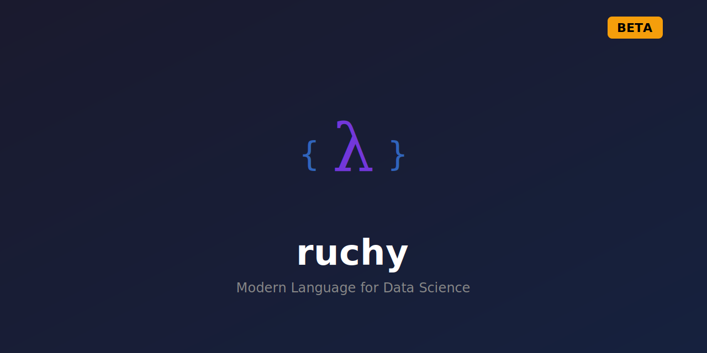

<div align="center">

<p align="center">
  
</p>

<h1 align="center">Ruchy</h1>

<p align="center">
  <b>Modern Language for Data Science and Scientific Computing</b>
</p>

<p align="center">
  <a href="https://opensource.org/licenses/MIT"></a>
  <a href="https://crates.io/crates/ruchy"></a>
  <a href="https://github.com/paiml/ruchy"></a>
</p>

</div>

---

A modern, expressive programming language for data science and scientific computing, featuring a self-hosting compiler, comprehensive tooling, and enterprise-grade quality standards.

## Installation

```bash
cargo install ruchy
```

## Quick Start

```bash
# Start interactive REPL
ruchy

# Run a script
ruchy script.ruchy

# Evaluate expression
ruchy -e "println(1 + 2)"

# Compile to binary
ruchy compile script.ruchy -o myapp
```

## Language Features

```ruchy
// Variables and functions
let name = "Ruchy"
fun greet(who) {
    println(f"Hello, {who}!")
}
greet(name)

// Pattern matching
let value = Some(42)
match value {
    Some(x) => println(f"Got {x}"),
    None => println("Nothing"),
}

// Labeled loops (v4.0)
'outer: for i in 0..10 {
    for j in 0..10 {
        if i * j > 50 {
            break 'outer
        }
    }
}

// Collections
let numbers = [1, 2, 3, 4, 5]
let doubled = numbers.map(|x| x * 2)
println(f"Doubled: {doubled:?}")
```

## Core Commands

| Command | Description |
|---------|-------------|
| `ruchy` | Start interactive REPL |
| `ruchy <file>` | Run a Ruchy script |
| `ruchy -e "<code>"` | Evaluate expression |
| `ruchy compile <file>` | Compile to binary |
| `ruchy transpile <file>` | Transpile to Rust |
| `ruchy check <file>` | Syntax check |
| `ruchy lint <file>` | Lint code |
| `ruchy fmt <path>` | Format code |
| `ruchy test <path>` | Run tests |

## Safety & Concurrency

Ruchy generates **100% safe Rust code** with full concurrency support:

- Thread-safe globals via `LazyLock<Mutex<T>>`
- Full async/await support (tokio runtime)
- Channels, atomics, and all Rust concurrency primitives
- Zero unsafe code in generated output

```ruchy
// Thread-safe by default
let mut counter = 0

fun increment() {
    counter = counter + 1  // Thread-safe
}

// Async functions
async fun fetch(url: String) -> String {
    let response = http::get(url).await?
    response.text().await
}
```

## WebAssembly

```bash
# Compile to WASM
ruchy wasm compile script.ruchy -o output.wasm

# Run WASM module
ruchy wasm run output.wasm
```

## MCP Server

Ruchy provides a Model Context Protocol server for Claude integration:

```bash
cargo install ruchy --features mcp
```

Add to Claude Desktop config:
```json
{
  "mcpServers": {
    "ruchy": {
      "command": "ruchy",
      "args": ["mcp"]
    }
  }
}
```

## Quality Standards

- **16,102 tests** passing
- **Zero clippy warnings**
- **200-point falsification** validation framework
- **Toyota Way** quality principles
- **PMAT A+** code standards

## Documentation

- [Language Specification](docs/SPECIFICATION.md)
- [Development Roadmap](docs/execution/roadmap.yaml)
- [Ruchy Book](https://github.com/paiml/ruchy-book) - Comprehensive guide
- 🤖 [Coursera Hugging Face AI Development Specialization](https://www.coursera.org/specializations/hugging-face-ai-development) - Build Production AI systems with Hugging Face in Pure Rust

## Contributing

Contributions are welcome! Please see the [CONTRIBUTING.md](CONTRIBUTING.md) guide for details.


## MSRV

Minimum Supported Rust Version: **1.75**

## License

MIT License - see [LICENSE](LICENSE) for details.

## Author

Noah Gift - [github.com/paiml/ruchy](https://github.com/paiml/ruchy)
