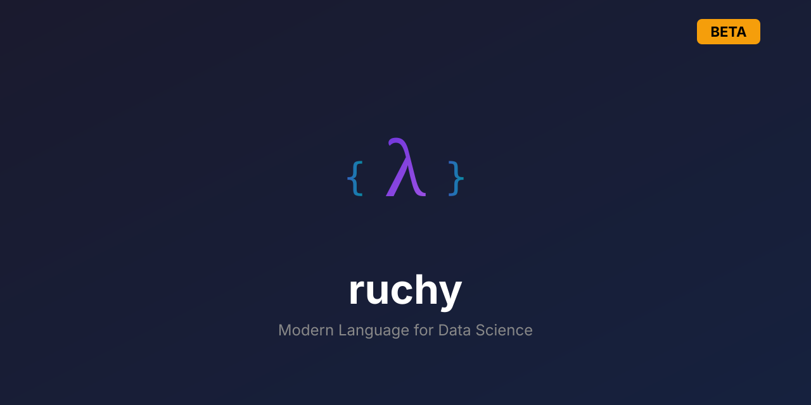

<div align="center">



<h1>Ruchy</h1>

[](https://github.com/paiml/ruchy/actions/workflows/ci.yml)
[](https://crates.io/crates/ruchy)
[](https://docs.rs/ruchy)
[](LICENSE)

</div>

Ruchy is a programming language with Python-like syntax. A program runs in the
built-in interpreter, or is transpiled to Rust and compiled to a native binary.

This README is checked by [`contracts/ruchy-readme-v1.yaml`](contracts/ruchy-readme-v1.yaml):
every example below is a file under `examples/readme/` that CI runs against the
`ruchy` binary built from the same commit.

## Install

The current version is a pre-release, so name it explicitly:

```bash
cargo install ruchy --version 5.0.0-beta.2
```

Plain `cargo install ruchy` installs the latest stable release instead.

## Quick start

```bash
ruchy examples/readme/hello.ruchy
ruchy -e "println(1 + 2)"
ruchy check examples/readme/match.ruchy
ruchy transpile examples/readme/collections.ruchy
ruchy compile examples/readme/collections.ruchy -o collections
```

Running `ruchy` with no arguments starts the REPL.

## Examples

Functions and f-strings (`examples/readme/hello.ruchy`):

```ruchy
let name = "Ruchy"
fun greet(who) {
    println(f"Hello, {who}!")
}
greet(name)
```

Pattern matching (`examples/readme/match.ruchy`):

```ruchy
let value = Some(42)
match value {
    Some(x) => println(f"Got {x}"),
    None => println("Nothing"),
}
```

Labeled loops (`examples/readme/loops.ruchy`):

```ruchy
let mut found = 0
'outer: for i in 1..10 {
    for j in 1..10 {
        if i * j > 50 {
            found = i * j
            break 'outer
        }
    }
}
println(f"First product over 50: {found}")
```

Collections (`examples/readme/collections.ruchy`):

```ruchy
let numbers = [1, 2, 3, 4, 5]
let doubled = numbers.map(|x| x * 2)
println(f"Doubled: {doubled:?}")
```

## Commands

`ruchy --help` lists every subcommand. The ones used most:

| Command | Description |
|---------|-------------|
| `ruchy run` | Run a script (also `ruchy <file>`) |
| `ruchy repl` | Start the interactive REPL |
| `ruchy check` | Check syntax |
| `ruchy transpile` | Transpile to Rust |
| `ruchy compile` | Compile to a native binary |
| `ruchy lint` | Lint a file |
| `ruchy test` | Run `@test` functions |
| `ruchy wasm` | Compile to a WebAssembly module |

## Documentation

- [Language specification](docs/SPECIFICATION.md)
- [Roadmap](docs/roadmaps/roadmap.yaml)
- [Contributing](CONTRIBUTING.md)
- [Ruchy Book](https://github.com/paiml/ruchy-book)
- [Ruchy Cookbook](https://github.com/paiml/ruchy-cookbook)

## MSRV

Minimum supported Rust version: **1.91**.

## License

MIT. See [LICENSE](LICENSE).
