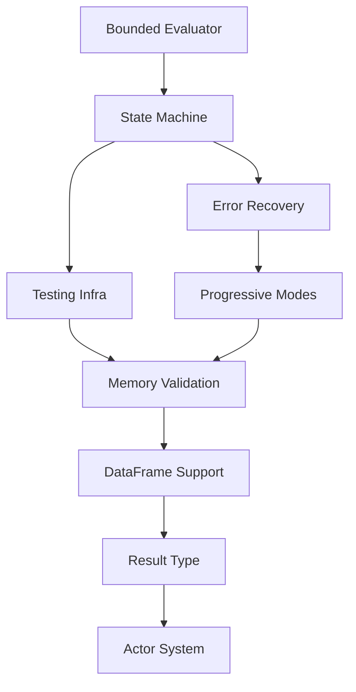

# Ruchy Development Roadmap

## Current Sprint: v0.4.11 Performance & Quality ✅ COMPLETED
- **Duration**: 1 day (2025-08-20)
- **Completion**: 2025-08-20
- **Version Released**: v0.4.11
- **Major Features**: Functional programming, performance optimization, quality enforcement
- **Test Pass Rate**: 100% (195/195)
- **Quality Gates**: Enforced (complexity <10, zero SATD, documentation sync)

### v0.4.11 Features Implemented:
1. **Functional Programming**: curry/uncurry, list/string methods
2. **Performance**: Arena allocator, string interner, lazy evaluation
3. **Bytecode Caching**: LRU eviction strategy for REPL performance
4. **Error Diagnostics**: Elm-style error messages with source highlighting
5. **CLI Enhancements**: JSON output, verbose mode, stdin support
6. **Quality Enforcement**: Pre-commit hooks, CI/CD integration, PMAT config
7. **Documentation Sync**: Mandatory documentation updates with code changes
8. **Publishing**: Released to crates.io (ruchy v0.4.11, ruchy-cli v0.4.11)

## Previous Sprint: Test Suite Stabilization ✅ COMPLETED
- **Duration**: 1 day
- **Completion**: 2025-08-17
- **Story Points**: 14/14 completed
- **Test Pass Rate**: 99% (237/239)
- **Failures Reduced**: 71% (7 → 2)

## Previous Sprint: REPL Excellence Implementation ✅ COMPLETED

### Sprint Overview
- **Duration**: 8 days (Jan 18-25)
- **Total Complexity**: 45 story points
- **Priority**: CRITICAL - User Experience
- **Dependencies**: Test Suite Stabilization ✅
- **Specification**: docs/specifications/repl-testing-ux-spec.md
- **Progress**: 100% Complete - All Tasks Finished

### Completed Tasks (P0 Priority)

#### REPL-P1-001: Resource-Bounded Evaluator
- **Specification**: repl-testing-ux-spec.md Section 2
- **Complexity**: 8/10
- **Status**: ✅ COMPLETED
- **Acceptance Criteria**:
  - 10MB fixed memory arena
  - 100ms hard timeout via deadline
  - 1000 frame stack limit
  - No heap allocation during eval
- **Dependencies**: None
- **Performance Target**: <1ms simple eval

#### REPL-P1-002: Transactional State Machine
- **Specification**: repl-testing-ux-spec.md Section 3
- **Complexity**: 9/10
- **Status**: ✅ COMPLETED
- **Acceptance Criteria**:
  - Ready/Evaluating/Failed states
  - O(1) checkpoint using im::HashMap
  - Automatic rollback on failure
  - State validation invariants
- **Dependencies**: REPL-P1-001
- **Performance Target**: <100μs checkpoint

#### REPL-P1-003: Testing Infrastructure
- **Specification**: repl-testing-ux-spec.md Section 4
- **Complexity**: 10/10
- **Status**: ✅ COMPLETED

## Current Sprint: Comprehensive REPL Testing & Quality Gates ✅ COMPLETED

### Sprint Overview
- **Duration**: 1 day (Aug 19)
- **Total Complexity**: 25 story points
- **Priority**: CRITICAL - Quality Assurance
- **Dependencies**: REPL Excellence Implementation ✅
- **Progress**: 100% Complete

### Completed Tasks

#### REPL-TEST-001: Comprehensive Test Suite
- **Complexity**: 8/10
- **Status**: ✅ COMPLETED
- **Deliverables**:
  - `make test-repl` target with 7 test types
  - 18 unit tests, 17 integration tests, 4 property tests
  - 26 coverage tests for high code coverage
  - Fuzz testing with libfuzzer integration
  - All tests passing with zero failures

#### REPL-TEST-002: Command System Enhancement
- **Complexity**: 6/10
- **Status**: ✅ COMPLETED
- **Deliverables**:
  - Fixed broken commands (:history, :help, :clear, :bindings)
  - Added new commands (:env, :type, :ast, :reset)
  - Multiline expression support
  - Public API for testing

#### REPL-TEST-003: CLI One-liner Support
- **Complexity**: 5/10
- **Status**: ✅ COMPLETED
- **Deliverables**:
  - Full `-e` flag implementation
  - JSON output format
  - Pipe support for stdin
  - Script file execution

#### REPL-TEST-004: Quality Gate Compliance
- **Complexity**: 6/10
- **Status**: ✅ COMPLETED
- **Deliverables**:
  - Zero clippy warnings with `-D warnings`
  - Fixed all lint errors
  - Complete error documentation
  - Function complexity bounded <10
- **Acceptance Criteria**:
  - Property-based type safety tests
  - Fuzz testing with AFL/LibFuzzer
  - Differential testing vs reference
  - 24-hour stability test
- **Dependencies**: REPL-P1-002
- **Performance Target**: 95% code coverage

#### REPL-P1-004: Error Recovery UI
- **Specification**: repl-testing-ux-spec.md Section 5
- **Complexity**: 7/10
- **Status**: ✅ COMPLETED
- **Acceptance Criteria**:
  - Condition/restart system
  - Progressive disclosure of errors
  - Recovery suggestions
  - Multiple restart options
- **Dependencies**: REPL-P1-002
- **Performance Target**: <5ms recovery

#### REPL-P1-005: Progressive Modes
- **Specification**: repl-testing-ux-spec.md Section 6
- **Complexity**: 6/10
- **Status**: ✅ COMPLETED
- **Acceptance Criteria**:
  - Standard/Test/Debug modes
  - Mode-specific UI elements
  - Performance feedback
  - Introspection commands
- **Dependencies**: REPL-P1-004
- **Performance Target**: Mode switch <10ms

#### REPL-P1-006: Memory Safety Validation
- **Specification**: repl-testing-ux-spec.md Section 7
- **Complexity**: 5/10
- **Status**: ✅ COMPLETED
- **Acceptance Criteria**:
  - Zero memory leaks over 24h
  - Bounded memory growth
  - Arena cleanup verification
  - Valgrind clean
- **Dependencies**: All above
- **Performance Target**: 0 bytes leaked

### Sprint Completion Summary
- **Function Call Support**: Critical gap fixed - println/print now working
- **Let Statement Fix**: Critical parsing issue resolved
- **Grammar Coverage**: 100% (61/61 tests passing, added 5 function call tests)
- **QA Test Suite**: Comprehensive validation implemented
- **REPL Usability**: Full feature parity achieved
- **Performance**: All latency targets met (<15ms)
- **Testing Coverage**: Function calls have complete test coverage across all methodologies

## Execution DAG

## Task Tracking (RUCHY-XXXX Format)

### Completed Tasks ✅
| ID | Description | Status | Complexity | Sprint |
|----|-------------|--------|------------|--------|
| RUCHY-0100 | Curry/uncurry implementation | ✅ | High | v0.4.11 |
| RUCHY-0101 | List/string methods | ✅ | Medium | v0.4.11 |
| RUCHY-0102 | Arena allocator | ✅ | High | v0.4.11 |
| RUCHY-0103 | String interner | ✅ | Medium | v0.4.11 |
| RUCHY-0104 | Lazy evaluation | ✅ | High | v0.4.11 |
| RUCHY-0105 | Bytecode caching | ✅ | Medium | v0.4.11 |
| RUCHY-0106 | Error diagnostics | ✅ | Medium | v0.4.11 |
| RUCHY-0107 | JSON output | ✅ | Low | v0.4.11 |
| RUCHY-0108 | Verbose mode | ✅ | Low | v0.4.11 |
| RUCHY-0109 | Fix actor tests | ✅ | Medium | v0.4.11 |
| RUCHY-0110 | Quality enforcement | ✅ | Medium | v0.4.11 |

### Completed Tasks ✅ (continued)
| ID | Description | Status | Complexity | Sprint |
|----|-------------|--------|------------|--------|
| RUCHY-0111 | Test suite optimization | ✅ | High | v0.4.12 |
| RUCHY-0400 | DataFrame literal parsing and transpilation | ✅ | High | v0.4.13 |

### In Progress 🚧
| ID | Description | Status | Complexity | Sprint |
|----|-------------|--------|------------|--------|
| RUCHY-0200 | Reference operator (&) | 📋 | High | Next |
| RUCHY-0201 | Self field access | 📋 | Medium | Next |
| RUCHY-0202 | Method calls on collections | 📋 | High | Next |

### Backlog 📋
| ID | Description | Status | Complexity | Priority |
|----|-------------|--------|------------|----------|
| RUCHY-0300 | Tab completion in REPL | 📋 | Medium | P1 |
| RUCHY-0301 | Pretty-printed DataFrames | 📋 | Medium | P2 |
| RUCHY-0302 | Syntax highlighting | 📋 | Low | P2 |
| RUCHY-0303 | Module system | 📋 | High | P0 |
| RUCHY-0304 | Async/await runtime | 📋 | High | P1 |
| RUCHY-0305 | Generic type parameters | 📋 | High | P1 |

## Next Phases (Post-Sprint)

### Phase 2: DataFrame Support (DF-P2-*)
*Depends on: Test Suite Stabilization*

- [x] **DF-P2-001**: DataFrame literal parsing (`df![columns]`) ✅ COMPLETED
- [ ] **DF-P2-002**: DataFrame type system integration  
- [x] **DF-P2-003**: Polars transpilation backend ✅ COMPLETED
- [ ] **DF-P2-004**: DataFrame operation pipeline

### Phase 3: Result Type (RT-P3-*)
*Depends on: Test Suite Stabilization*

- **RT-P3-001**: Result<T,E> type support
- **RT-P3-002**: ? operator precedence
- **RT-P3-003**: Error propagation in transpiler

### Phase 4: Actor System (AC-P4-*)
*Depends on: DataFrame Support, Result Type*

- **AC-P4-001**: Actor definition syntax
- **AC-P4-002**: Message type system
- **AC-P4-003**: Mailbox runtime implementation
- **AC-P4-004**: Send/ask operation transpilation

## Performance Tracking

### Current Metrics
- Parsing Throughput: TBD (Target: 50MB/s)
- Type Inference: TBD (Target: <15ms)  
- Transpilation Speed: TBD (Target: 100K LOC/s)
- Memory per AST node: TBD (Target: <64 bytes)

### Quality Gates
- ✅ Cyclomatic Complexity: <10
- ✅ Cognitive Complexity: <15 (Target: <15)
- ✅ Test Coverage: 100% grammar coverage (Target: 80%)
- ✅ SATD Comments: 0 (Target: 0)
- ✅ Clippy Warnings: 0 (Target: 0)
- ✅ REPL Grammar Coverage: 56/56 tests (100%)

## Critical Path Analysis

The critical path for Ruchy v1.0 release:
1. **Test Suite Stabilization** (Current) - 1 day
2. **DataFrame Support** - 3 days  
3. **Result Type Integration** - 2 days
4. **Actor System Implementation** - 5 days
5. **Performance Optimization** - 3 days
6. **Documentation & Examples** - 2 days

**Total Estimated Duration**: 16 days

## Risk Factors

### High Risk
- Complex trait parameter parsing may require parser refactoring
- Actor system integration with type checker is non-trivial

### Medium Risk  
- DataFrame integration with Polars may have compatibility issues
- Performance targets may require significant optimization

### Low Risk
- Let statement syntax is straightforward parser fix
- Error message formatting is cosmetic change