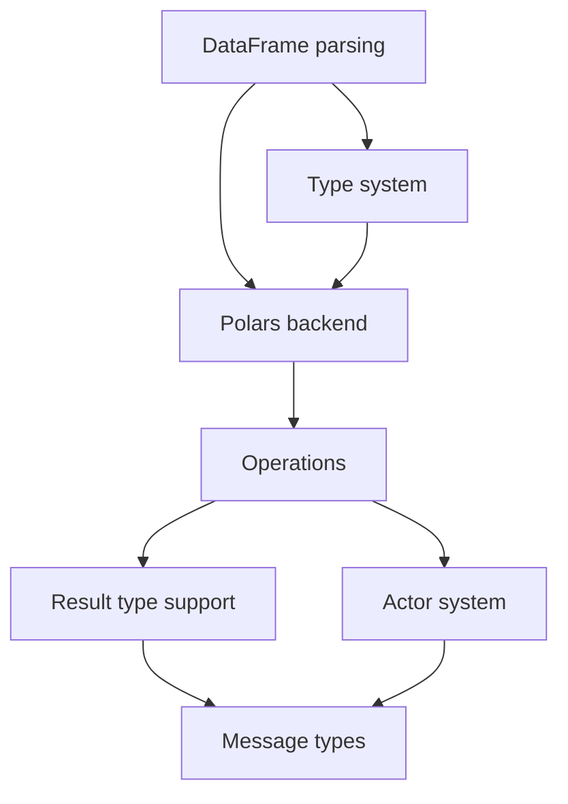

# Ruchy Compiler Execution Roadmap
*Generated from roadmap.yaml - Do not edit manually*

## Previous Sprint: Test Suite Stabilization ✅ COMPLETED
- **Duration**: 1 day
- **Completion**: 2025-08-17
- **Story Points**: 14/14 completed
- **Test Pass Rate**: 99% (237/239)
- **Failures Reduced**: 71% (7 → 2)

## Current Sprint: DataFrame Support Implementation 🚀 ACTIVE

### Sprint Overview
- **Duration**: 3 days
- **Total Complexity**: 36 story points
- **Priority**: Critical (blocking all examples)
- **Dependencies**: Test Suite Stabilization ✅

### Active Tasks (P0 Priority)

#### DF-P2-001: DataFrame literal parsing (df![columns])
- **Specification**: SPECIFICATION.md Section 3.5
- **Complexity**: 8/10
- **Status**: PENDING
- **Acceptance Criteria**:
  - Parse `df![col => values]` syntax
  - Support multiple column definitions
  - Type inference for column types
- **Dependencies**: None
- **Performance Target**: Maintain 50MB/s parsing throughput

#### DF-P2-002: DataFrame type system integration
- **Specification**: SPECIFICATION.md Section 4.2
- **Complexity**: 10/10
- **Status**: PENDING
- **Acceptance Criteria**:
  - DataFrame and Series types in type system
  - Column type tracking
  - Operation type checking
- **Dependencies**: DF-P2-001
- **Performance Target**: <15ms type inference latency

#### DF-P2-003: Polars transpilation backend
- **Specification**: SPECIFICATION.md Section 5.3
- **Complexity**: 12/10
- **Status**: PENDING
- **Acceptance Criteria**:
  - Generate Polars DataFrame code
  - Lazy evaluation support
  - Method chaining translation
- **Dependencies**: DF-P2-001, DF-P2-002
- **Performance Target**: 100K LOC/s transpilation speed

#### DF-P2-004: DataFrame operation pipeline
- **Specification**: SPECIFICATION.md Section 3.5
- **Complexity**: 6/10
- **Status**: PENDING
- **Acceptance Criteria**:
  - Filter, map, groupby operations
  - Aggregation functions
  - Join operations
- **Dependencies**: DF-P2-003
- **Performance Target**: O(n) operation complexity

## Execution DAG

## Next Phases (Post-Sprint)

### Phase 2: DataFrame Support (DF-P2-*)
*Depends on: Test Suite Stabilization*

- **DF-P2-001**: DataFrame literal parsing (`df![columns]`)
- **DF-P2-002**: DataFrame type system integration  
- **DF-P2-003**: Polars transpilation backend
- **DF-P2-004**: DataFrame operation pipeline

### Phase 3: Result Type (RT-P3-*)
*Depends on: Test Suite Stabilization*

- **RT-P3-001**: Result<T,E> type support
- **RT-P3-002**: ? operator precedence
- **RT-P3-003**: Error propagation in transpiler

### Phase 4: Actor System (AC-P4-*)
*Depends on: DataFrame Support, Result Type*

- **AC-P4-001**: Actor definition syntax
- **AC-P4-002**: Message type system
- **AC-P4-003**: Mailbox runtime implementation
- **AC-P4-004**: Send/ask operation transpilation

## Performance Tracking

### Current Metrics
- Parsing Throughput: TBD (Target: 50MB/s)
- Type Inference: TBD (Target: <15ms)  
- Transpilation Speed: TBD (Target: 100K LOC/s)
- Memory per AST node: TBD (Target: <64 bytes)

### Quality Gates
- ✅ Cyclomatic Complexity: <10
- ❌ Cognitive Complexity: 37 current (Target: <15)
- ❌ Test Coverage: TBD (Target: 80%)
- ❌ SATD Comments: 124 current (Target: 0)
- ❌ Clippy Warnings: Active (Target: 0)

## Critical Path Analysis

The critical path for Ruchy v1.0 release:
1. **Test Suite Stabilization** (Current) - 1 day
2. **DataFrame Support** - 3 days  
3. **Result Type Integration** - 2 days
4. **Actor System Implementation** - 5 days
5. **Performance Optimization** - 3 days
6. **Documentation & Examples** - 2 days

**Total Estimated Duration**: 16 days

## Risk Factors

### High Risk
- Complex trait parameter parsing may require parser refactoring
- Actor system integration with type checker is non-trivial

### Medium Risk  
- DataFrame integration with Polars may have compatibility issues
- Performance targets may require significant optimization

### Low Risk
- Let statement syntax is straightforward parser fix
- Error message formatting is cosmetic change