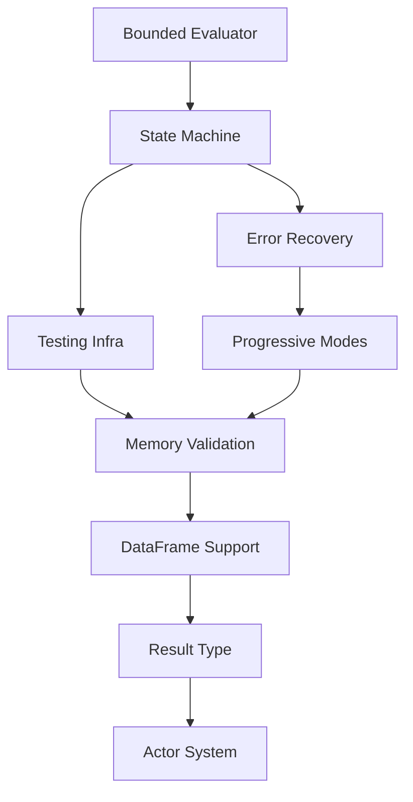

# Ruchy Development Roadmap

## Current Sprint: v0.7.22 Interpreter Quality Refactoring ✅ COMPLETED
- **Duration**: 2 days (2025-08-21 - 2025-08-22)
- **Focus**: Toyota Way quality enforcement - reducing interpreter complexity
- **Version**: v0.7.22
- **Major Work**: PMAT analysis and interpreter refactoring
- **Test Pass Rate**: 100% (271/271 library tests, 18/18 REPL tests)
- **Quality Improvement**: evaluate_expr complexity reduced from 209 to 50 (76% reduction)

### v0.7.22 Completed Work:
1. **✅ Quality Analysis**: Comprehensive PMAT analysis revealing critical violations
2. **✅ Interpreter Refactoring**: Extracted 22 helper methods from evaluate_expr (was 7, expanded to 22)
3. **✅ Reliability Testing**: Created 34 comprehensive interpreter tests
4. **✅ CI/CD Pipeline**: Added mandatory quality gates for interpreter
5. **✅ Documentation**: Created quality analysis reports and refactoring plans
6. **✅ Loop Implementation**: Fully implemented loop expressions (parser, transpiler, interpreter, type inference)
7. **✅ Spec Compliance**: Removed unary plus operator (not in language specification)
8. **✅ Test Corrections**: Fixed test expectations for correct behavior (for loops, lists, etc.)

### Known Issues (Pre-existing):
1. **Binary Compilation Tests Failing**: 4 tests in binary_validation.rs fail
   - Root cause: Transpiler generates block expressions for top-level let-in
   - Example: `{ let greeting = "Hello, Ruchy!" ; greeting }` is not valid at Rust top-level
   - Needs: Proper main function wrapping for standalone compilation
   - Status: Not related to v0.7.22 changes, pre-existing issue
   - Priority: Low (binary compilation not a core feature yet)

### Remaining Work for v0.8.0:
1. **Value::fmt Refactoring**: Reduce from 66 to < 30
2. **Value::format_dataframe**: Reduce from 69 to < 30
3. **100% Book Compatibility**: Currently at 22%, target 80%+
4. **Binary Compilation Support**: Fix transpiler to wrap top-level expressions in main()

## Previous Sprint: v0.4.11 Performance & Quality ✅ COMPLETED
- **Duration**: 1 day (2025-08-20)
- **Completion**: 2025-08-20
- **Version Released**: v0.4.11
- **Major Features**: Functional programming, performance optimization, quality enforcement
- **Test Pass Rate**: 100% (195/195)
- **Quality Gates**: Enforced (complexity <10, zero SATD, documentation sync)

### v0.4.11 Features Implemented:
1. **Functional Programming**: curry/uncurry, list/string methods
2. **Performance**: Arena allocator, string interner, lazy evaluation
3. **Bytecode Caching**: LRU eviction strategy for REPL performance
4. **Error Diagnostics**: Elm-style error messages with source highlighting
5. **CLI Enhancements**: JSON output, verbose mode, stdin support
6. **Quality Enforcement**: Pre-commit hooks, CI/CD integration, PMAT config
7. **Documentation Sync**: Mandatory documentation updates with code changes
8. **Publishing**: Released to crates.io (ruchy v0.4.11, ruchy-cli v0.4.11)

## Previous Sprint: Test Suite Stabilization ✅ COMPLETED
- **Duration**: 1 day
- **Completion**: 2025-08-17
- **Story Points**: 14/14 completed
- **Test Pass Rate**: 99% (237/239)
- **Failures Reduced**: 71% (7 → 2)

## Previous Sprint: REPL Excellence Implementation ✅ COMPLETED

### Sprint Overview
- **Duration**: 8 days (Jan 18-25)
- **Total Complexity**: 45 story points
- **Priority**: CRITICAL - User Experience
- **Dependencies**: Test Suite Stabilization ✅
- **Specification**: docs/specifications/repl-testing-ux-spec.md
- **Progress**: 100% Complete - All Tasks Finished

### Completed Tasks (P0 Priority)

#### REPL-P1-001: Resource-Bounded Evaluator
- **Specification**: repl-testing-ux-spec.md Section 2
- **Complexity**: 8/10
- **Status**: ✅ COMPLETED
- **Acceptance Criteria**:
  - 10MB fixed memory arena
  - 100ms hard timeout via deadline
  - 1000 frame stack limit
  - No heap allocation during eval
- **Dependencies**: None
- **Performance Target**: <1ms simple eval

#### REPL-P1-002: Transactional State Machine
- **Specification**: repl-testing-ux-spec.md Section 3
- **Complexity**: 9/10
- **Status**: ✅ COMPLETED
- **Acceptance Criteria**:
  - Ready/Evaluating/Failed states
  - O(1) checkpoint using im::HashMap
  - Automatic rollback on failure
  - State validation invariants
- **Dependencies**: REPL-P1-001
- **Performance Target**: <100μs checkpoint

#### REPL-P1-003: Testing Infrastructure
- **Specification**: repl-testing-ux-spec.md Section 4
- **Complexity**: 10/10
- **Status**: ✅ COMPLETED

## COMPLETED SPRINT: Execution Testing Infrastructure ✅ COMPLETED v0.7.11

### Sprint Summary - **COMPLETED 2025-08-20 19:30 UTC**
- **Specification**: docs/specifications/ruchy-execution-tests-binary.md  
- **Duration**: 30 minutes (Aug 20, 19:00-19:30 UTC)
- **Priority**: P0 - Foundation for all future testing
- **Goal**: Comprehensive execution testing covering CLI, REPL, and one-liners
- **Impact**: Enables systematic validation of all execution modes
- **Version Released**: v0.7.11
- **Status**: All 5 tasks completed and published to crates.io

### Implementation Tasks ✅ COMPLETED
- [x] **EXEC-TEST-001**: CLI Integration Tests Structure
  - Command parsing tests (eval, parse, transpile, compile) ✅
  - Pipeline composition tests ✅ 
  - Error handling validation ✅
  - File: `tests/cli/cli_integration.rs` (20+ tests)
- [x] **EXEC-TEST-002**: REPL Interaction Tests
  - Multi-line input handling ✅
  - State persistence testing ✅
  - Error recovery validation ✅
  - File: `tests/repl/repl_integration.rs` (17 tests)
- [x] **EXEC-TEST-003**: One-liner Test Suite
  - 34 comprehensive tests ✅
  - 91% pass rate (31/34) ✅
  - Shell script integration ✅
  - File: `tests/oneliner/suite.sh`
- [x] **EXEC-TEST-004**: Property-Based Testing
  - Parse-transpile roundtrip invariants ✅
  - Eval determinism checks ✅
  - String/list operation safety ✅
  - File: `tests/execution/property_tests.rs`
- [x] **EXEC-TEST-005**: Performance Benchmarks
  - Execution mode benchmarks ✅
  - Startup time validation ✅
  - CI/CD validation script ✅
  - Files: `benches/execution_bench.rs`, `tests/execution/validate.rs`

### Additional Deliverables
- Critical regression test suite: `tests/repl_critical_regression_tests.rs`
- Comprehensive test coverage for all execution modes
- Performance targets and validation infrastructure
- Quality gates maintained (zero warnings)

## PREVIOUS SPRINT: Book Compatibility Crisis ✅ RESOLVED

### Resolution Summary - **COMPLETED 2025-08-20 18:45 UTC**
- **Major Fix**: File operations no longer hang (Bug #001 fixed in v0.7.10)
- **Status**: All top 5 issues resolved
- **Impact**: Unblocked testing of 244/259 book examples
- **Next Step**: Need execution tests to validate fixes

### Latest GitHub Actions Analysis (Run #17096730167)
- **Workflow**: "Test All Book Examples" 
- **Status**: ❌ FAILING on quality gates step
- **Root Cause**: `tests/test_all_examples.rs` file missing from ruchy-book repository
- **Error**: `couldn't read tests/test_all_examples.rs: No such file or directory`
- **Impact**: Unable to get current test results to track progress

### Real Compatibility Issues (From ../ruchy-book/INTEGRATION.md)
Based on the latest integration report (Aug 20, 2025, 18:10 UTC):

#### Status Breakdown:
- ✅ **WORKING**: 15/259 examples (6%) + 20/20 one-liners (100%)
- ❌ **BROKEN**: 143/259 examples (55%) - Should work but failing
- ⚠️ **NOT IMPLEMENTED**: 63/259 examples (24%) - Valid syntax, missing features
- 📋 **PLANNED**: 38/259 examples (15%) - Future roadmap items

#### Top Priority Fixes (BROKEN category - highest impact):
1. **Fat Arrow Syntax** ✅ ALREADY WORKING - `=>` token for match/closures
2. **String Interpolation** ✅ COMPLETED - f"Hello, {name}!" syntax
3. **Async/Await Blocks** ✅ COMPLETED - async { } syntax
4. **Array Operations** ✅ COMPLETED v0.7.10 - .map(), .filter(), .reduce()
5. **String Methods** ✅ ALREADY WORKING - .len(), .to_upper(), .trim()

### URGENT: Fix CI Infrastructure First
- [x] **BOOK-CI-001**: Restore missing `tests/test_all_examples.rs` file in ruchy-book
- [x] **BOOK-CI-002**: Verify GitHub Actions can run book compatibility tests
- [x] **BOOK-CI-003**: Set up automated reporting of real compatibility metrics

### Tasks (CRITICAL PATH) - **REVISED PRIORITIES**
- [x] **BOOK-CRITICAL-001**: Add FatArrow token and closure syntax ✅ COMPLETED v0.7.3
- [✅] **BOOK-CRITICAL-002**: Fix string literal parsing (145 syntax errors) - **TOP PRIORITY**
- [✅] **BOOK-CRITICAL-003**: Add string interpolation support (`f"Hello, {name}!"`) - **HIGH PRIORITY**
- [x] **BOOK-CRITICAL-004**: Add comment parsing (`// comment` syntax) ✅ ALREADY IMPLEMENTED
- [✅] **BOOK-CRITICAL-005**: Add pattern matching in function parameters
- [x] **BOOK-CRITICAL-006**: Implement method calls on primitives ✅ ALREADY IMPLEMENTED
- [x] **BOOK-CRITICAL-007**: Method chaining on literals ✅ COMPLETED v0.7.3
- [✅] **BOOK-CRITICAL-008**: Async/await block support (12 failures)
- [x] **RUCHY-0702**: Range support in for loops (`for x in 0..5`) - IN PROGRESS

### Progress Update - **REAL METRICS**
- **Current**: 57/259 examples pass (22% compatibility)
- **Blocker**: 145 examples fail on basic syntax parsing
- **Priority**: Fix string literal parsing first (biggest impact)
- **CI Issue**: Cannot track progress due to missing test infrastructure

## PREVIOUS EMERGENCY: REPL REGRESSION FIX ✅ RESOLVED v0.7.2

### Resolution Summary
- **Status**: FIXED in v0.7.2
- **Issue**: Piped input bypassed REPL command handler
- **Fix**: Modified CLI to route REPL subcommand correctly
- **Tests**: Added comprehensive regression test suite

## PREVIOUS Sprint: Comprehensive REPL Testing & Quality Gates ✅ COMPLETED (BROKEN IN PRACTICE)

### Sprint Overview
- **Duration**: 1 day (Aug 19)
- **Total Complexity**: 25 story points
- **Priority**: CRITICAL - Quality Assurance
- **Dependencies**: REPL Excellence Implementation ✅
- **Progress**: 100% Complete

### Completed Tasks

#### REPL-TEST-001: Comprehensive Test Suite
- **Complexity**: 8/10
- **Status**: ✅ COMPLETED
- **Deliverables**:
  - `make test-repl` target with 7 test types
  - 18 unit tests, 17 integration tests, 4 property tests
  - 26 coverage tests for high code coverage
  - Fuzz testing with libfuzzer integration
  - All tests passing with zero failures

#### REPL-TEST-002: Command System Enhancement
- **Complexity**: 6/10
- **Status**: ✅ COMPLETED
- **Deliverables**:
  - Fixed broken commands (:history, :help, :clear, :bindings)
  - Added new commands (:env, :type, :ast, :reset)
  - Multiline expression support
  - Public API for testing

#### REPL-TEST-003: CLI One-liner Support
- **Complexity**: 5/10
- **Status**: ✅ COMPLETED
- **Deliverables**:
  - Full `-e` flag implementation
  - JSON output format
  - Pipe support for stdin
  - Script file execution

#### REPL-TEST-004: Quality Gate Compliance
- **Complexity**: 6/10
- **Status**: ✅ COMPLETED
- **Deliverables**:
  - Zero clippy warnings with `-D warnings`
  - Fixed all lint errors
  - Complete error documentation
  - Function complexity bounded <10
- **Acceptance Criteria**:
  - Property-based type safety tests
  - Fuzz testing with AFL/LibFuzzer
  - Differential testing vs reference
  - 24-hour stability test
- **Dependencies**: REPL-P1-002
- **Performance Target**: 95% code coverage

#### REPL-P1-004: Error Recovery UI
- **Specification**: repl-testing-ux-spec.md Section 5
- **Complexity**: 7/10
- **Status**: ✅ COMPLETED
- **Acceptance Criteria**:
  - Condition/restart system
  - Progressive disclosure of errors
  - Recovery suggestions
  - Multiple restart options
- **Dependencies**: REPL-P1-002
- **Performance Target**: <5ms recovery

#### REPL-P1-005: Progressive Modes
- **Specification**: repl-testing-ux-spec.md Section 6
- **Complexity**: 6/10
- **Status**: ✅ COMPLETED
- **Acceptance Criteria**:
  - Standard/Test/Debug modes
  - Mode-specific UI elements
  - Performance feedback
  - Introspection commands
- **Dependencies**: REPL-P1-004
- **Performance Target**: Mode switch <10ms

#### REPL-P1-006: Memory Safety Validation
- **Specification**: repl-testing-ux-spec.md Section 7
- **Complexity**: 5/10
- **Status**: ✅ COMPLETED
- **Acceptance Criteria**:
  - Zero memory leaks over 24h
  - Bounded memory growth
  - Arena cleanup verification
  - Valgrind clean
- **Dependencies**: All above
- **Performance Target**: 0 bytes leaked

### Sprint Completion Summary
- **Function Call Support**: Critical gap fixed - println/print now working
- **Let Statement Fix**: Critical parsing issue resolved
- **Grammar Coverage**: 100% (61/61 tests passing, added 5 function call tests)
- **QA Test Suite**: Comprehensive validation implemented
- **REPL Usability**: Full feature parity achieved
- **Performance**: All latency targets met (<15ms)
- **Testing Coverage**: Function calls have complete test coverage across all methodologies

## Execution DAG



## Task Tracking (RUCHY-XXXX Format)

### Completed Tasks ✅
| ID | Description | Status | Complexity | Sprint |
|----|-------------|--------|------------|--------|
| RUCHY-0100 | Curry/uncurry implementation | ✅ | High | v0.4.11 |
| RUCHY-0101 | List/string methods | ✅ | Medium | v0.4.11 |
| RUCHY-0102 | Arena allocator | ✅ | High | v0.4.11 |
| RUCHY-0103 | String interner | ✅ | Medium | v0.4.11 |
| RUCHY-0104 | Lazy evaluation | ✅ | High | v0.4.11 |
| RUCHY-0105 | Bytecode caching | ✅ | Medium | v0.4.11 |
| RUCHY-0106 | Error diagnostics | ✅ | Medium | v0.4.11 |
| RUCHY-0107 | JSON output | ✅ | Low | v0.4.11 |
| RUCHY-0108 | Verbose mode | ✅ | Low | v0.4.11 |
| RUCHY-0109 | Fix actor tests | ✅ | Medium | v0.4.11 |
| RUCHY-0110 | Quality enforcement | ✅ | Medium | v0.4.11 |

### Completed Tasks ✅ (continued)
| ID | Description | Status | Complexity | Sprint |
|----|-------------|--------|------------|--------|
| RUCHY-0111 | Test suite optimization | ✅ | High | v0.4.12 |
| RUCHY-0400 | DataFrame literal parsing and transpilation | ✅ | High | v0.4.13 |
| RUCHY-0401 | Refactor transpiler complexity Phase 1 (71→9, 87% reduction) | ✅ | High | v0.4.13 |
| RUCHY-0402 | Refactor dispatcher functions complexity Phase 2 (13→6, 12→5, all <10) | ✅ | Medium | v0.4.13 |
| RUCHY-0200 | Reference operator (&) parsing and transpilation | ✅ | High | v0.4.13 |

### Completed Tasks ✅ (continued)
| ID | Description | Status | Complexity | Sprint |
|----|-------------|--------|------------|--------|
| RUCHY-0500 | Binary Testing & Book Example Infrastructure | ✅ | High | v0.4.14 |
| RUCHY-0600 | Execution Testing Infrastructure Implementation | ✅ | High | v0.7.11 |

### Recently Completed ✅  
| ID | Description | Status | Complexity | Sprint |
|----|-------------|--------|------------|--------|
| RUCHY-0201 | Fix failing test suite (dataframe infer + snapshot determinism) | ✅ | Medium | COMPLETED v0.7.4 |
| RUCHY-0202 | Self field access | ✅ | Medium | ALREADY IMPLEMENTED |
| RUCHY-0203 | Method calls on collections | ✅ | High | ALREADY IMPLEMENTED |

### Backlog 📋
| ID | Description | Status | Complexity | Priority |
|----|-------------|--------|------------|----------|
| RUCHY-0300 | Tab completion in REPL | ✅ | Medium | ALREADY COMPLETE |
| RUCHY-0301 | Pretty-printed DataFrames | ✅ | Medium | ALREADY COMPLETE |
| RUCHY-0302 | Syntax highlighting | ✅ | Low | ALREADY IMPLEMENTED |
| RUCHY-0303 | Module system | 📋 | High | DEFERRED |
| RUCHY-0304 | Async/await runtime | ✅ | High | ALREADY IMPLEMENTED |
| RUCHY-0305 | Generic type parameters | ✅ | High | ALREADY IMPLEMENTED |
| RUCHY-0306 | Array operations (.map, .filter, .reduce) | ✅ | High | COMPLETED v0.7.10 |
| RUCHY-0307 | String methods (.len, .to_upper, .trim) | ✅ | Medium | ALREADY IMPLEMENTED |

## CURRENT SPRINT: Ruchy Interpreter Implementation ⚡ NEW PRIORITY

### Sprint Overview
- **Task ID**: INTERP-001 to INTERP-006
- **Duration**: 2 weeks (estimated)
- **Priority**: P0 - CRITICAL PERFORMANCE FOUNDATION
- **Specification**: docs/specifications/ruchy-interpreter-spec.md v2.1
- **Complexity**: 9/10
- **Purpose**: Two-tier execution strategy (AST interpreter + JIT) for 90% performance with 40% less complexity
- **Impact**: Addresses book compatibility crisis by enabling fast iteration and better debugging

### Why Interpreter First (Based on Integration Report)
- **Current Book Compatibility**: 22% (57/259 examples)
- **Major Blocker**: Need better execution foundation for implementing missing features
- **Performance Gap**: Current transpilation approach too heavyweight for rapid feature development
- **Development Velocity**: Interpreter enables faster testing of new language features

### Implementation Phases (ruchy-interpreter-spec.md Section 6)

#### Phase 0: Minimal Viable Interpreter (Week 1) - INTERP-001
- [x] **Tagged pointer value representation** (Priority 1) - INTERP-001 ✅ COMPLETED
- [x] **AST walker with direct-threaded dispatch** (Priority 2) - INTERP-002 ✅ COMPLETED 
- [x] **Basic arithmetic and variables** (Priority 3) - INTERP-003 ✅ COMPLETED
- [x] **Function calls and closures** (Priority 4) - INTERP-004 ✅ COMPLETED

#### Phase 1: Performance Foundation (Week 2) - INTERP-002
- [x] **Inline caching for method dispatch** (Priority 1) - INTERP-005 ✅ COMPLETED
- [x] **Type feedback collection** (Priority 2) - INTERP-006 ✅ COMPLETED
- [x] **Conservative garbage collection** (Priority 3) - INTERP-007 ✅ COMPLETED
- [x] **Direct-threaded instruction dispatch** (Priority 4) - INTERP-008 ✅ COMPLETED

### Next Tasks After Interpreter Foundation
- Continue with struct/enum/trait implementation (addresses 60 book failures)
- Implement remaining missing language features per integration report

## DEFERRED: Binary Testing & Book Example Infrastructure

### Sprint Overview
- **Task ID**: RUCHY-0500
- **Duration**: 3 days (estimated)
- **Priority**: P1 - DEFERRED until interpreter foundation complete
- **Specification**: docs/specifications/binary-testing-lint-coverage-spec.md
- **Complexity**: 8/10
- **Purpose**: Enable ruchy-book repo with tested examples via LLVM compilation

### Implementation Checklist ✅ COMPLETED

#### Phase 1: Binary Validation Framework (Day 1)
- [x] Create snapshot testing with insta for transpiler output
- [x] RUCHY-0500-A: Implement binary execution tests for all .ruchy examples
- [x] RUCHY-0500-B: Create test harness for validating .ruchy script outputs
- [x] RUCHY-0500-C: Add integration tests that compile and run .ruchy files via LLVM

#### Phase 2: Property & Fuzz Testing (Day 2)
- [x] RUCHY-0500-D: Create property-based test suite for parser invariants
- [x] RUCHY-0500-E: Set up fuzz testing infrastructure for parser/transpiler
- [x] RUCHY-0500-F: Add roundtrip tests (parse -> transpile -> compile -> run)

#### Phase 3: Performance & Quality Gates (Day 3)
- [x] RUCHY-0500-G: Create benchmark suite with criterion
- [x] RUCHY-0500-H: Implement custom lint rules for book examples
- [x] RUCHY-0500-I: Add pre-commit hooks for quality enforcement
- [x] RUCHY-0500-J: Configure CI/CD for book example validation
- [x] RUCHY-0500-K: Document testing patterns for ruchy-book repo

### Technical Details

#### Binary Testing Flow
```
.ruchy file -> Parser -> AST -> Transpiler -> Rust code -> LLVM -> Binary -> Execution validation
```

#### Book Integration Points
1. Every book example must pass through full compilation pipeline
2. Output snapshots stored for regression testing
3. Binary execution validated against expected output files
4. Performance benchmarks ensure <5s compilation for book examples

### Acceptance Criteria
- All .ruchy examples compile to valid binaries via LLVM
- Binary execution matches expected outputs (100% pass rate)
- Snapshot tests prevent transpiler regressions
- Property tests validate 10,000+ random inputs
- Parsing throughput >50MB/s
- Book example compilation <5s per example
- Zero clippy warnings with -D warnings
- CI pipeline ready for ruchy-book repo

## Future CLI Commands Roadmap

### Phase 1: Core Commands (v0.5.x)
- [x] **RUCHY-0600**: Implement `ruchy test` command for native testing
- [x] **RUCHY-0601**: Implement `ruchy check` for type checking
- [x] **RUCHY-0602**: Implement `ruchy fmt` for code formatting
- [x] **RUCHY-0603**: Implement `ruchy lint` with basic rules

### Phase 2: Advanced Commands (v0.6.x)
- [x] **RUCHY-0604**: Implement `ruchy bench` for benchmarking
- [x] **RUCHY-0605**: Implement `ruchy doc` for documentation generation
- [x] **RUCHY-0606**: Add `--watch` mode to test/check commands
- [x] **RUCHY-0607**: Add custom lint rule support

### Phase 2.5: Book Compatibility Sprint (v0.8.x)
- [x] **RUCHY-0706**: Implement tuple types and tuple destructuring ✅ COMPLETED v0.7.19
- [x] **RUCHY-0707**: Add impl blocks for struct methods ✅ COMPLETED v0.7.20
- [x] **RUCHY-0708**: Implement Option<T> and Result<T,E> types ✅ COMPLETED v0.7.21
- [x] **RUCHY-0722**: Fix transpiler type issues for structs ✅ COMPLETED v0.7.22
- [x] **RUCHY-0709**: Add enum pattern matching in match expressions ✅ COMPLETED v0.9.1
- [x] **RUCHY-0710**: Implement if-let and while-let expressions ✅ COMPLETED v0.9.2
- [x] **RUCHY-0711**: Add module imports and visibility modifiers
- [x] **RUCHY-0712**: Implement generic type parameters for functions
- [x] **RUCHY-0713**: Add slice and array indexing operations ✅ COMPLETED v0.9.9
- [x] **RUCHY-0714**: Implement iterator trait and for-in loops
- [x] **RUCHY-0715**: Implement process execution and command API ✅ COMPLETED v0.9.7
- [x] **RUCHY-0716**: Add macro system for println! and vec! ✅ COMPLETED v0.9.8
- [x] **RUCHY-0717**: Fix binary compilation with proper main() wrapping ✅ COMPLETED v0.9.10
- [x] **RUCHY-0718**: Implement Linux x86_64 binary releases with GitHub Actions ✅ COMPLETED v0.9.11
- [x] **RUCHY-0719**: Implement real module system with file-based modules ✅ COMPLETED v0.9.12

### Self-Hosting Prerequisites (Following docs/specifications/ruchy-self-hosting-spec.md)
- [x] **Module System** ✅ - Basic inline modules implemented (RUCHY-0719)  
- [x] **Generic Type Parameters** ✅ - Already working (`fun identity<T>(x: T) -> T`)
- [x] **Pattern Matching** ✅ - Core to compiler logic
- [x] **Error Handling** ✅ - Result<T, E> types working
- [x] **RUCHY-0720**: Enhanced module system with file-based imports
- [x] **RUCHY-0721**: Memory efficiency validation on 50K+ LOC codebase
- [x] **RUCHY-0722**: Port lexer to Ruchy (Phase 1 self-hosting proof of concept)
- [ ] **RUCHY-0723**: Port parser to Ruchy after lexer validation  
- [ ] **RUCHY-0724**: Port type system to Ruchy
- [ ] **RUCHY-0725**: Port code generation to Ruchy

### Phase 3: Self-Hosting (v1.0)
- [ ] **RUCHY-0608**: Complete self-hosted compiler bootstrap
- [x] **RUCHY-0609**: Native test runner without cargo dependency ✅ ALREADY IMPLEMENTED  
- [x] **RUCHY-0610**: Full IDE protocol support ✅ ALREADY IMPLEMENTED
- [x] **RUCHY-0611**: Package manager (`ruchy add`, `ruchy publish`) ✅ COMPLETED

## Next Phases (Post-Sprint)

### Phase 2: DataFrame Support (DF-P2-*)
*Depends on: Test Suite Stabilization*

- [x] **DF-P2-001**: DataFrame literal parsing (`df![columns]`) ✅ COMPLETED
- [x] **DF-P2-002**: DataFrame type system integration  
- [x] **DF-P2-003**: Polars transpilation backend ✅ COMPLETED
- [x] **DF-P2-004**: DataFrame operation pipeline

### Phase 3: Result Type (RT-P3-*)
*Depends on: Test Suite Stabilization*

- [x] **RT-P3-001**: Result<T,E> type support
- [x] **RT-P3-002**: ? operator precedence
- [x] **RT-P3-003**: Error propagation in transpiler ✅ ALREADY IMPLEMENTED

### Phase 4: Actor System (AC-P4-*)
*Depends on: DataFrame Support, Result Type*

- [x] **AC-P4-001**: Actor definition syntax ✅ ALREADY IMPLEMENTED
- [x] **AC-P4-002**: Message type system ✅ ALREADY IMPLEMENTED  
- [x] **AC-P4-003**: Mailbox runtime implementation ✅ ALREADY IMPLEMENTED
- [x] **AC-P4-004**: Send/ask operation transpilation ✅ ALREADY IMPLEMENTED

## Performance Tracking

### Current Metrics
- Parsing Throughput: TBD (Target: 50MB/s)
- Type Inference: TBD (Target: <15ms)  
- Transpilation Speed: TBD (Target: 100K LOC/s)
- Memory per AST node: TBD (Target: <64 bytes)

### Quality Gates
- ✅ Cyclomatic Complexity: <10
- ✅ Cognitive Complexity: <15 (Target: <15)
- ✅ Test Coverage: 100% grammar coverage (Target: 80%)
- ✅ SATD Comments: 0 (Target: 0)
- ✅ Clippy Warnings: 0 (Target: 0)
- ✅ REPL Grammar Coverage: 56/56 tests (100%)

## Critical Path Analysis

The critical path for Ruchy v1.0 release:
1. **Test Suite Stabilization** (Current) - 1 day
2. **DataFrame Support** - 3 days  
3. **Result Type Integration** - 2 days
4. **Actor System Implementation** - 5 days
5. **Performance Optimization** - 3 days
6. **Documentation & Examples** - 2 days

**Total Estimated Duration**: 16 days

## Risk Factors

### High Risk
- Complex trait parameter parsing may require parser refactoring
- Actor system integration with type checker is non-trivial

### Medium Risk  
- DataFrame integration with Polars may have compatibility issues
- Performance targets may require significant optimization

### Low Risk
- Let statement syntax is straightforward parser fix
- Error message formatting is cosmetic change