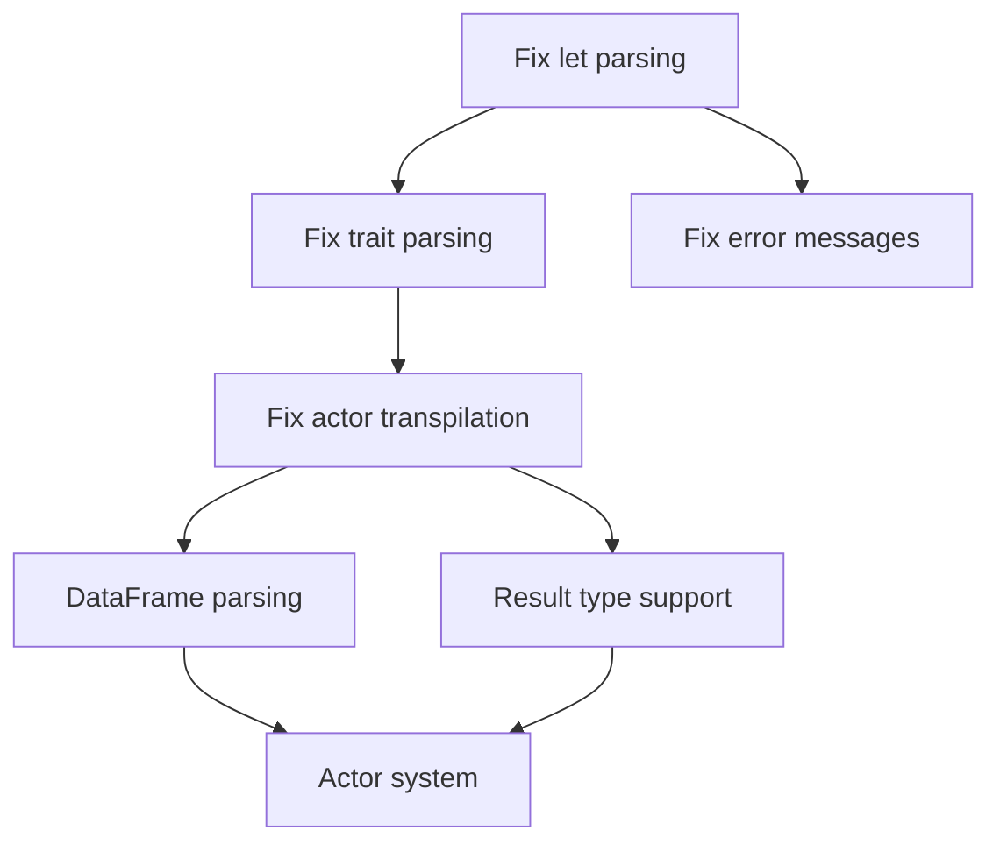

# Ruchy Compiler Execution Roadmap
*Generated from roadmap.yaml - Do not edit manually*

## Current Sprint: Test Suite Stabilization

### Active Tasks (P0 Priority)

#### QA-P1-001: Fix let statement syntax parsing
- **Specification**: SPECIFICATION.md Section 2.4
- **Complexity**: 3/10
- **Status**: IN_PROGRESS
- **Issue**: Parser expects ML-style `let x = value in body` but tests use `let x = value`
- **Dependencies**: None
- **Performance Target**: Maintain 50MB/s parsing throughput

#### QA-P1-002: Fix trait parameter parsing  
- **Specification**: SPECIFICATION.md Section 2.2
- **Complexity**: 5/10
- **Status**: PENDING
- **Issue**: Parameter parser fails on `&self` syntax in trait methods
- **Dependencies**: QA-P1-001
- **Performance Target**: <15ms type inference latency

#### QA-P1-003: Fix actor send/ask transpilation
- **Specification**: SPECIFICATION.md Section 3.1
- **Complexity**: 4/10
- **Status**: PENDING
- **Issue**: Transpiler output format doesn't match test expectations
- **Dependencies**: QA-P1-001, QA-P1-002
- **Performance Target**: 100K LOC/s transpilation speed

#### QA-P1-004: Fix error message formatting
- **Specification**: SPECIFICATION.md Section 7
- **Complexity**: 2/10
- **Status**: PENDING
- **Issue**: Error messages don't contain expected "Expected" text
- **Dependencies**: QA-P1-001
- **Performance Target**: N/A

## Execution DAG

## Next Phases (Post-Sprint)

### Phase 2: DataFrame Support (DF-P2-*)
*Depends on: Test Suite Stabilization*

- **DF-P2-001**: DataFrame literal parsing (`df![columns]`)
- **DF-P2-002**: DataFrame type system integration  
- **DF-P2-003**: Polars transpilation backend
- **DF-P2-004**: DataFrame operation pipeline

### Phase 3: Result Type (RT-P3-*)
*Depends on: Test Suite Stabilization*

- **RT-P3-001**: Result<T,E> type support
- **RT-P3-002**: ? operator precedence
- **RT-P3-003**: Error propagation in transpiler

### Phase 4: Actor System (AC-P4-*)
*Depends on: DataFrame Support, Result Type*

- **AC-P4-001**: Actor definition syntax
- **AC-P4-002**: Message type system
- **AC-P4-003**: Mailbox runtime implementation
- **AC-P4-004**: Send/ask operation transpilation

## Performance Tracking

### Current Metrics
- Parsing Throughput: TBD (Target: 50MB/s)
- Type Inference: TBD (Target: <15ms)  
- Transpilation Speed: TBD (Target: 100K LOC/s)
- Memory per AST node: TBD (Target: <64 bytes)

### Quality Gates
- ✅ Cyclomatic Complexity: <10
- ❌ Cognitive Complexity: 37 current (Target: <15)
- ❌ Test Coverage: TBD (Target: 80%)
- ❌ SATD Comments: 124 current (Target: 0)
- ❌ Clippy Warnings: Active (Target: 0)

## Critical Path Analysis

The critical path for Ruchy v1.0 release:
1. **Test Suite Stabilization** (Current) - 1 day
2. **DataFrame Support** - 3 days  
3. **Result Type Integration** - 2 days
4. **Actor System Implementation** - 5 days
5. **Performance Optimization** - 3 days
6. **Documentation & Examples** - 2 days

**Total Estimated Duration**: 16 days

## Risk Factors

### High Risk
- Complex trait parameter parsing may require parser refactoring
- Actor system integration with type checker is non-trivial

### Medium Risk  
- DataFrame integration with Polars may have compatibility issues
- Performance targets may require significant optimization

### Low Risk
- Let statement syntax is straightforward parser fix
- Error message formatting is cosmetic change