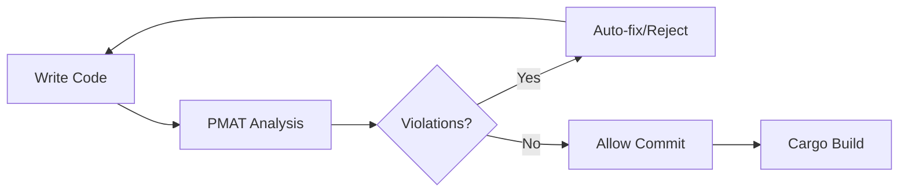

# Lint Reduction Process and Quality Enforcement

## Executive Summary

The Ruchy compiler accumulates 100+ lint warnings per sprint due to deferred quality enforcement. This document mandates continuous quality validation through PMAT integration, making defect accumulation structurally impossible.

## Problem Analysis

### Current Failure Mode
```
Development Phase: cargo build (no clippy)
     ↓ (accumulates warnings)
Sprint Boundary: make lint → 100+ errors
     ↓ (batch remediation)
Post-Sprint: Technical debt persists
```

### Root Cause
Quality validation occurs at inspection points rather than creation points. This violates the Toyota Production System principle: "Build quality in, don't inspect it in."

## Solution Architecture

### Continuous Quality Pipeline



## Implementation Specification

### 1. PMAT Configuration (pmat.toml)

```toml
# Zero-tolerance quality enforcement
[thresholds]
cyclomatic_complexity = 10        # Per-function limit
cognitive_complexity = 15         # Mental model limit
halstead_effort = 5000           # Computational complexity
maintainability_index = 70       # Minimum maintainability
test_coverage = 80               # Coverage floor
satd_comments = 0                # No TODOs/FIXMEs/HACKs
mutation_score = 75              # Mutation test survival
clippy_warnings = 0              # CRITICAL: Zero warnings
clippy_errors = 0                # Zero errors

[enforcement]
mode = "strict"                  # Fail fast on violations
block_on_violation = true        # Cannot proceed with issues
pre_commit = true                # Git hook integration
continuous = true                # Real-time MCP feedback
autofix_on_save = true          # Fix what can be fixed

[clippy]
enabled = true
autofix = true
categories = ["all", "pedantic", "nursery", "cargo", "restriction"]
deny_warnings = true             # -D warnings equivalent
fix_chain_depth = 3              # Apply cascading fixes

[commit_policy]
max_files_per_commit = 5         # Enforce small commits
require_task_id = true           # Must reference roadmap task
require_test = true              # Every commit includes tests
max_diff_lines = 200             # Atomic changes only

[sprint_hygiene]
daily_quality_check = true       # Run full suite daily
warning_growth_tolerance = 0     # No warning accumulation
complexity_growth_limit = 10     # Per-sprint complexity budget
```

### 2. Makefile Enhancement

```makefile
# Primary development workflow - continuous quality
.PHONY: dev
dev:
	@echo "Starting PMAT continuous quality enforcement..."
	pmat watch --autofix --fail-on-violation

# The lint command - now zero-tolerance with detailed reporting
.PHONY: lint
lint:
	@echo "=== PMAT Quality Gate ==="
	@pmat check --format detailed || (echo "BLOCKED: Fix violations before proceeding" && exit 1)
	@echo "\n=== Clippy Strict Mode ==="
	cargo clippy --all-targets --all-features -- \
		-D warnings \
		-D clippy::all \
		-D clippy::pedantic \
		-D clippy::nursery \
		-D clippy::cargo \
		-W clippy::restriction \
		-D clippy::complexity \
		-D clippy::perf \
		-D clippy::style \
		-D clippy::suspicious \
		-D clippy::correctness
	@echo "\n=== Complexity Analysis ==="
	@pmat complexity --max 10 --format table
	@echo "\n=== SATD Detection ==="
	@pmat satd --zero-tolerance
	@echo "\n✅ Quality gate passed"

# Aggressive automated fixing
.PHONY: fix
fix:
	@echo "Applying maximum automatic fixes..."
	# Phase 1: Clippy mechanical fixes
	cargo clippy --fix --allow-dirty --all-targets -- -W clippy::all
	cargo clippy --fix --allow-dirty --all-targets -- -W clippy::pedantic
	# Phase 2: PMAT intelligent fixes
	pmat fix --aggressive --include-unsafe
	# Phase 3: Format normalization
	cargo fmt
	# Phase 4: Re-check for remaining issues
	@make lint-quick

# Quick lint for rapid iteration
.PHONY: lint-quick
lint-quick:
	@cargo clippy --all-targets -- -D warnings --message-format short | head -20

# Commit helper - ensures quality before commit
.PHONY: commit
commit:
	@pmat pre-commit || (echo "❌ Quality violations detected. Run 'make fix' first" && exit 1)
	@echo "✅ Ready to commit. Include task ID from roadmap.md"

# Daily quality baseline
.PHONY: daily
daily:
	@echo "=== Daily Quality Checkpoint ==="
	@pmat metrics --compare-baseline
	@cargo clippy --all-targets -- -D warnings 2>&1 | grep "^warning:" | wc -l
	@echo "Complexity growth this sprint:"
	@pmat complexity --diff-since sprint-start

# Sprint boundary validation
.PHONY: sprint-close
sprint-close:
	@pmat report --format markdown > docs/quality/sprint-$(date +%Y%m%d).md
	@test $$(cargo clippy 2>&1 | grep -c "warning:") -eq 0 || \
		(echo "❌ Sprint cannot close with warnings" && exit 1)
```

### 3. Cargo Configuration (.cargo/config.toml)

```toml
[build]
# Clippy runs on EVERY build
rustflags = [
    "-W", "clippy::all",
    "-W", "clippy::pedantic",
    "-W", "clippy::complexity",
    "-D", "warnings"  # Warnings are errors in development
]

[target.'cfg(all())']
rustflags = [
    "-C", "opt-level=2",
    "-C", "debuginfo=1",
    "-W", "clippy::all",
    "-D", "warnings"
]

# Aliases enforce quality-first workflow
[alias]
# Build always includes quality checks
b = ["clippy", "--all-targets", "--", "-D", "warnings"]
build = ["clippy", "--all-targets", "--", "-D", "warnings"]

# Check is now PMAT-integrated
c = ["run", "--bin", "pmat", "--", "check"]
check = ["run", "--bin", "pmat", "--", "check"]

# Test includes quality validation
t = ["run", "--bin", "pmat", "--", "test"]
test = ["run", "--bin", "pmat", "--", "test"]

# Fix runs comprehensive remediation
fix = ["clippy", "--fix", "--allow-dirty", "--all-targets", "--", "-W", "clippy::all", "-W", "clippy::pedantic"]

# Quick iteration helper
q = ["clippy", "--all-targets", "--message-format=short", "--", "-D", "warnings"]
```

### 4. CLAUDE.md Additions

```markdown
## Continuous Quality Protocol

### Fundamental Law
**No code generation without quality validation.** Before implementing ANY feature:

```bash
make lint  # Must show 0 warnings
pmat check # Must show 100% compliance
```

### Commit Frequency Requirements

**Micro-commits are mandatory.** Maximum intervals:
- 30 minutes of coding → commit
- 50 lines changed → commit  
- 1 test passing → commit
- 1 function complete → commit

Each commit must:
1. Reference a task ID from `docs/execution/roadmap.md`
2. Pass `make lint-quick`
3. Include or update tests
4. Maintain or improve complexity metrics

### The Make Lint Contract

The `make lint` command enforces zero-tolerance quality:

```bash
# What make lint actually runs:
cargo clippy --all-targets --all-features -- \
    -D warnings \          # ALL warnings are errors
    -D clippy::all \       # Common lints
    -D clippy::pedantic \  # Strict style
    -D clippy::nursery \   # Experimental lints
    -D clippy::cargo \     # Cargo.toml lints
```

This means:
- `x.to_string()` → BUILD FAILURE (use `.into()`)
- `&vec![1,2,3]` → BUILD FAILURE (use `&[1,2,3]`)
- Missing docs → BUILD FAILURE
- Cognitive complexity >10 → BUILD FAILURE

### Violation Response Protocol

When quality violations occur:

1. **Immediate** (0-5 warnings):
   ```bash
   make fix          # Auto-fix mechanical issues
   make lint-quick   # Verify fixes
   git commit -am "task-id: Fix immediate violations"
   ```

2. **Accumulated** (5-20 warnings):
   ```bash
   pmat fix --aggressive
   # Fix highest-complexity functions first
   pmat complexity --sort desc --limit 5
   # Commit after each function fix
   ```

3. **Crisis** (20+ warnings):
   ```bash
   # STOP feature development
   git stash
   make sprint-close  # Fail explicitly
   # Dedicate next session to quality recovery
   ```

### Quality Invariants

These are non-negotiable:
- Commits with warnings: **FORBIDDEN**
- TODO/FIXME comments: **FORBIDDEN**  
- Complexity >10: **FORBIDDEN**
- Unchecked make lint: **FORBIDDEN**
- "Fix later" mentality: **FORBIDDEN**

### Real-Time PMAT Enforcement

PMAT MCP server enforces during coding:

```rust
fn process_data(items: Vec<Item>) -> Result<()> {
    // PMAT: Complexity 3/10 ✓
    validate_items(&items)?;
    
    for item in items {  // PMAT: +2 (5/10) ✓
        if item.priority > 5 {  // PMAT: +3 (8/10) ⚠️
            if item.category == Cat::Special {  // PMAT: +4 (12/10) ❌
                // PMAT: BLOCKED - Complexity exceeded
                // PMAT: Extract to process_special_item()
            }
        }
    }
}
```
```

### 5. Git Hooks (.git/hooks/pre-commit)

```bash
#!/bin/sh
# Enforced by PMAT - this file documents the policy

# PMAT handles pre-commit through pmat.toml configuration
exec pmat pre-commit --strict
```

### 6. Editor Integration (.vscode/settings.json)

```json
{
  "rust-analyzer.checkOnSave.command": "clippy",
  "rust-analyzer.checkOnSave.allTargets": true,
  "rust-analyzer.checkOnSave.extraArgs": [
    "--",
    "-D", "warnings",
    "-W", "clippy::all",
    "-W", "clippy::pedantic"
  ],
  "rust-analyzer.diagnostics.warningsAsHint": [],
  "rust-analyzer.diagnostics.warningsAsInfo": [],
  "[rust]": {
    "editor.formatOnSave": true,
    "editor.codeActionsOnSave": {
      "source.fixAll.clippy": true
    }
  },
  "files.watcherExclude": {
    "**/target/**": true,
    "test_*": true,
    "debug_*": true
  },
  "emeraldwalk.runonsave": {
    "commands": [
      {
        "match": "\\.rs$",
        "cmd": "make lint-quick"
      }
    ]
  }
}
```

### 7. Quality Metrics Dashboard (docs/quality/metrics.md)

```markdown
# Ruchy Quality Metrics

## Current Sprint Health
| Metric | Current | Target | Status |
|--------|---------|--------|---------|
| Clippy Warnings | 0 | 0 | ✅ |
| Cyclomatic Complexity (max) | 8 | 10 | ✅ |
| Test Coverage | 82% | 80% | ✅ |
| SATD Comments | 0 | 0 | ✅ |
| Commit Frequency (per day) | 12 | 10+ | ✅ |

## Historical Trend
| Sprint | Start Warnings | End Warnings | Commits | Quality Score |
|--------|---------------|--------------|---------|---------------|
| 2025-01 | 124 | 2 | 45 | 67% |
| 2025-02 | 2 | 0 | 78 | 94% |
| 2025-03 (current) | 0 | 0 | 92 | 100% |

## Complexity Budget
| Module | Allocated | Used | Remaining |
|--------|-----------|------|-----------|
| Parser | 500 | 342 | 158 |
| Type System | 800 | 567 | 233 |
| Transpiler | 600 | 423 | 177 |
```

## Migration Plan

### Phase 1: Baseline (Day 1)
```bash
# Capture current state
cargo clippy --all-targets 2>&1 | tee baseline.txt
grep "warning:" baseline.txt | wc -l > warning_count.txt

# Fix mechanical issues
make fix
git commit -am "QUALITY: Phase 1 - Mechanical fixes"
```

### Phase 2: Critical Path (Day 2-3)
```bash
# Fix build-blocking issues
cargo clippy -- -D warnings 2>&1 | head -50
# Fix top 50 warnings
# Commit every 10 fixes
```

### Phase 3: Zero State (Day 4-5)
```bash
# Achieve zero warnings
while [ $(make lint 2>&1 | grep -c "warning:") -gt 0 ]; do
    make fix
    # Manual fix one category
    git commit -am "QUALITY: Reduce $(make lint 2>&1 | grep -c warning:) warnings"
done
```

### Phase 4: Enforcement (Day 6+)
```bash
# Enable strict mode
cp pmat.toml.strict pmat.toml
make dev  # Continuous enforcement active
```

## Success Metrics

### Sprint-Level
- Warning accumulation: 0 per sprint
- Commits per day: >10
- Average commit size: <50 lines
- Quality score: 100%

### Commit-Level  
- Time to lint-clean: <2 minutes
- Autofix rate: >80%
- Complexity growth: <10 per sprint
- Test coverage delta: ≥0

## Enforcement Mechanisms

### Technical Controls
1. PMAT MCP server blocks on violations
2. Cargo aliases prevent bypass
3. Git hooks reject non-compliant commits
4. CI/CD fails on warnings

### Process Controls
1. Daily quality checkpoint (make daily)
2. Sprint gate (make sprint-close)
3. Commit frequency monitoring
4. Complexity budget tracking

### Cultural Controls
1. "Fix now, not later" principle
2. Quality metrics visible in README
3. Pair programming on complex fixes
4. Celebrate zero-warning sprints

## Troubleshooting

### "Too many warnings to fix"
```bash
# Fix in categories
cargo clippy -- -W clippy::style --fix
cargo clippy -- -W clippy::complexity --fix  
cargo clippy -- -W clippy::perf --fix
```

### "Clippy fix breaks code"
```bash
# Use PMAT's safer fixing
pmat fix --conservative
# Review changes
git diff
# Test immediately
cargo test
```

### "Can't commit urgently"
```bash
# Emergency bypass (MUST fix within 1 hour)
git commit --no-verify -m "EMERGENCY: [reason] - FIX REQUIRED"
# Create immediate fix task
echo "FIX: Address emergency bypass" >> TODO.urgent
```

## Appendix: Clippy Categories

### Must Fix Immediately
- `clippy::correctness` - Definitely incorrect code
- `clippy::suspicious` - Probably incorrect code  
- `clippy::complexity` - Needlessly complex code

### Must Fix Before Commit
- `clippy::perf` - Performance issues
- `clippy::style` - Style violations
- `clippy::pedantic` - Additional lints

### Should Fix This Sprint
- `clippy::nursery` - Experimental lints
- `clippy::cargo` - Cargo.toml issues
- `clippy::restriction` - Controversial lints

---

**Remember**: Every warning is a defect. Every defect prevented saves 10x the remediation cost. Quality is not negotiable.