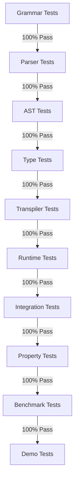

# EXTREME Test-Driven Development Specification
## Actor System Implementation for Ruchy

### Core Philosophy: No Code Without Tests

**The Iron Laws of EXTREME-TDD:**
1. **Write the test first** - Not a single line of implementation before test exists
2. **Red-Green-Refactor** - See it fail, make it pass, make it beautiful
3. **Test drives design** - If it's hard to test, the design is wrong
4. **100% coverage is minimum** - Not aspirational, mandatory
5. **Every bug becomes a test** - Bugs can only happen once

### Test Hierarchy and Execution Order



### Phase 0: Test Infrastructure (Before Any Implementation)

```rust
// tests/test_framework.rs
pub struct TestContext {
    parser: Parser,
    typechecker: TypeChecker,
    transpiler: Transpiler,
    runtime: ActorRuntime,
}

impl TestContext {
    pub fn assert_parse_error(&self, input: &str, expected: ParseError) {
        let result = self.parser.parse(input);
        assert_matches!(result, Err(e) if e == expected);
    }
    
    pub fn assert_type_error(&self, input: &str, expected: TypeError) {
        let ast = self.parser.parse(input).unwrap();
        let result = self.typechecker.check(ast);
        assert_matches!(result, Err(e) if e == expected);
    }
    
    pub fn assert_runtime_behavior<T>(&self, input: &str, assertion: impl Fn(T)) {
        let compiled = self.compile_and_run(input);
        assertion(compiled);
    }
}

// Macro for test generation
macro_rules! parser_test {
    ($name:ident, $input:expr, $expected:expr) => {
        #[test]
        fn $name() {
            let ctx = TestContext::new();
            let result = ctx.parse($input);
            assert_eq!(result.unwrap(), $expected);
        }
    };
}

// Property test macro
macro_rules! property_test {
    ($name:ident, $property:expr) => {
        #[test]
        fn $name() {
            proptest!(|input: TestInput| {
                $property(input);
            });
        }
    };
}
```

### Phase 1: Grammar-First Testing

```rust
// tests/grammar/actor_grammar_test.rs

#[test]
fn test_actor_grammar_bnf() {
    let grammar = r#"
        actor_def := 'actor' IDENT '{' actor_body '}'
        actor_body := (field | receive | hook)*
        field := IDENT ':' type
        receive := 'receive' IDENT '(' params ')' block
        hook := ('on_restart' | 'on_child_failure') '(' params ')' block
    "#;
    
    assert!(validate_bnf(grammar));
}

#[test]
fn test_message_operator_precedence() {
    // ! and ? should have specific precedence
    assert_precedence_order(&[
        (".", 100),   // Method call highest
        ("?", 90),    // Ask
        ("!", 80),    // Send  
        ("|>", 70),   // Pipeline
        ("+", 50),    // Addition lower
    ]);
}

#[test]
fn test_supervision_grammar() {
    let grammar = r#"
        supervision := 'supervise' strategy '{' children '}'
        strategy := 'OneForOne' | 'AllForOne' | 'RestForOne'
        children := (actor_spawn)*
        actor_spawn := 'spawn' actor_type init_args
    "#;
    
    assert!(validate_bnf(grammar));
}
```

### Phase 2: Parser Test Suite

```rust
// tests/parser/actor_parser_test.rs

const ACTOR_TEST_CASES: &[(&str, &str, AST)] = &[
    // Minimal actor
    (
        "minimal_actor",
        "actor Empty {}",
        AST::Actor(Actor { name: "Empty", fields: vec![], receives: vec![], hooks: vec![] })
    ),
    
    // Actor with state
    (
        "stateful_actor",
        "actor Counter { value: i32 }",
        AST::Actor(Actor {
            name: "Counter",
            fields: vec![Field { name: "value", ty: Type::I32 }],
            receives: vec![],
            hooks: vec![]
        })
    ),
    
    // Actor with receive
    (
        "receive_actor",
        r#"actor Handler {
            receive process(msg: String) {
                println(msg)
            }
        }"#,
        AST::Actor(Actor {
            name: "Handler",
            fields: vec![],
            receives: vec![Receive {
                name: "process",
                params: vec![Param { name: "msg", ty: Type::String }],
                body: Block(vec![Expr::Call("println", vec![Expr::Var("msg")])])
            }],
            hooks: vec![]
        })
    )
];

// Generate tests from cases
fn generate_parser_tests() {
    for (name, input, expected) in ACTOR_TEST_CASES {
        parser_test!(name, input, expected);
    }
}

// Edge cases and error conditions
#[test]
fn test_parse_nested_actors_forbidden() {
    let input = r#"
        actor Outer {
            actor Inner {}  // Should fail
        }
    "#;
    
    assert_parse_error(input, ParseError::NestedActorNotAllowed);
}

#[test]
fn test_parse_receive_outside_actor_forbidden() {
    let input = "receive orphan() {}";
    assert_parse_error(input, ParseError::ReceiveOutsideActor);
}
```

### Phase 3: Type System Tests

```rust
// tests/typechecker/actor_type_test.rs

#[test]
fn test_actor_ref_type_creation() {
    let actor = Actor { name: "Worker", ..default() };
    let actor_ref = Type::ActorRef(Box::new(Type::Actor("Worker")));
    
    assert!(actor_ref.is_sendable());
    assert!(actor_ref.is_sync());
    assert!(!actor_ref.is_copy());
}

#[test]
fn test_actor_intrinsic_properties() {
    // Every actor has these properties available
    let actor_type = parse_and_type_check(r#"
        actor MyActor {
            receive identify() -> String {
                self.id  // Intrinsic property
            }
            receive get_parent() -> Option<ActorRef> {
                parent  // Available if supervised
            }
        }
    "#);
    
    assert!(actor_type.has_intrinsic("id"));
    assert!(actor_type.has_intrinsic("parent"));
}

#[test]
fn test_message_type_compatibility() {
    let test_cases = vec![
        // (receiver_expects, sent_type, should_succeed)
        (Type::I32, Type::I32, true),
        (Type::I32, Type::String, false),
        (Type::Generic("T"), Type::I32, true),  // Generic accepts concrete
        (Type::Option(Box::new(Type::I32)), Type::I32, false),
    ];
    
    for (expected, sent, should_succeed) in test_cases {
        let result = check_message_type(expected, sent);
        assert_eq!(result.is_ok(), should_succeed);
    }
}

#[test]
fn test_supervision_type_constraints() {
    // Supervisable trait requirements
    let supervisable = Trait {
        name: "Supervisable",
        methods: vec![
            Method { name: "on_restart", returns: Type::Unit },
            Method { name: "get_state", returns: Type::Generic("State") },
            Method { name: "restore_state", params: vec![Type::Generic("State")] },
        ]
    };
    
    let actor_with_hooks = parse_and_type_check(r#"
        actor Supervised {
            state: String,
            on_restart() { self.state = "" }
            get_state() -> String { self.state }
            restore_state(s: String) { self.state = s }
        }
    "#);
    
    assert!(actor_with_hooks.implements(&supervisable));
}
```

### Phase 4: Transpiler Tests

```rust
// tests/transpiler/actor_transpiler_test.rs

#[test]
fn test_minimal_actor_transpilation() {
    let input = "actor Minimal {}";
    let output = transpile(input).unwrap();
    
    // Verify structure
    assert_contains!(output, "struct Minimal {");
    assert_contains!(output, "impl Minimal {");
    assert_contains!(output, "enum MinimalMessage {");
    
    // Verify it compiles
    assert!(rustc_check(&output).is_ok());
}

#[test]
fn test_message_handling_generation() {
    let input = r#"
        actor Echo {
            receive echo(msg: String) -> String {
                msg
            }
        }
    "#;
    
    let output = transpile(input).unwrap();
    
    // Check generated message enum
    assert_contains!(output, "enum EchoMessage {");
    assert_contains!(output, "    Echo { msg: String, reply: oneshot::Sender<String> },");
    
    // Check handler
    assert_contains!(output, "async fn handle_message(&mut self, msg: EchoMessage)");
    assert_contains!(output, "EchoMessage::Echo { msg, reply } => {");
    assert_contains!(output, "reply.send(msg)");
    
    // Verify it compiles and runs
    let test_harness = format!("{}\n{}", output, r#"
        #[tokio::test]
        async fn test_echo() {
            let (actor, handle) = Echo::spawn();
            let result = handle.echo("hello".to_string()).await;
            assert_eq!(result, "hello");
        }
    "#);
    
    assert!(compile_and_test(&test_harness).is_ok());
}

#[test]
fn test_supervision_code_generation() {
    let input = r#"
        actor Supervised {
            attempts: i32,
            
            on_restart() {
                self.attempts = 0
            }
            
            receive risky() -> Result<String, Error> {
                self.attempts += 1;
                if self.attempts < 3 {
                    Err(Error::new("not yet"))
                } else {
                    Ok("success")
                }
            }
        }
    "#;
    
    let output = transpile(input).unwrap();
    
    // Verify supervision traits
    assert_contains!(output, "impl Supervisable for Supervised");
    assert_contains!(output, "fn on_restart(&mut self)");
    
    // Verify restart logic
    assert_contains!(output, "self.attempts = 0");
}

#[test]
fn test_pipeline_operator_transpilation() {
    let input = r#"
        actor Pipeline {
            receive process() {
                // Pipeline operator routes async response to handler
                other_actor !> long_operation() |> handle_result
            }
            
            receive handle_result(result: String) {
                println(result)
            }
        }
    "#;
    
    let output = transpile(input).unwrap();
    
    // Verify pipeline transpiles to reply_to pattern
    assert_contains!(output, "other_actor.send_with_reply(");
    assert_contains!(output, "LongOperationMessage {");
    assert_contains!(output, "reply_to: self.handle_result_channel()");
    
    // Verify it compiles
    assert!(rustc_check(&output).is_ok());
}
```

### Phase 5: Runtime Behavior Tests

```rust
// tests/runtime/actor_runtime_test.rs

#[tokio::test]
async fn test_actor_actually_processes_messages() {
    let code = r#"
        actor Counter {
            value: i32,
            receive increment() { self.value += 1 }
            receive get() -> i32 { self.value }
        }
    "#;
    
    let runtime = compile_and_load(code).await;
    let counter = runtime.spawn_actor("Counter", json!({"value": 0})).await;
    
    counter.send("increment", json!({})).await;
    counter.send("increment", json!({})).await;
    let result = counter.ask("get", json!({})).await;
    
    assert_eq!(result, json!(2));
}

#[tokio::test(flavor = "multi_thread")]
async fn test_concurrent_actors_isolated() {
    let code = r#"
        actor Isolated {
            value: i32,
            receive set(v: i32) { self.value = v }
            receive get() -> i32 { self.value }
        }
    "#;
    
    let runtime = compile_and_load(code).await;
    let actors: Vec<_> = (0..100)
        .map(|i| runtime.spawn_actor("Isolated", json!({"value": i})))
        .collect();
    
    // Concurrent modifications
    let handles: Vec<_> = actors.iter().enumerate().map(|(i, actor)| {
        tokio::spawn(async move {
            actor.send("set", json!(i * 2)).await;
            actor.ask("get", json!({})).await
        })
    }).collect();
    
    let results: Vec<i32> = futures::future::join_all(handles).await
        .into_iter()
        .map(|r| r.unwrap())
        .collect();
    
    // Each actor should have its own value
    for (i, result) in results.iter().enumerate() {
        assert_eq!(*result, i * 2);
    }
}

#[tokio::test]
async fn test_supervision_restarts_failed_actor() {
    let code = r#"
        actor Failing {
            attempts: i32,
            
            receive fail_then_succeed() -> Result<String, Error> {
                self.attempts += 1;
                if self.attempts <= 2 {
                    panic!("Simulated failure");
                }
                Ok("Success")
            }
            
            on_restart() {
                // Keep attempts to eventually succeed
            }
        }
    "#;
    
    let runtime = compile_and_load(code).await;
    let supervisor = runtime.create_supervisor(
        SupervisorStrategy::OneForOne,
        3,  // max restarts
        Duration::from_secs(60)
    ).await;
    
    let actor = supervisor.spawn_child("Failing", json!({"attempts": 0})).await;
    
    // Should fail twice, restart each time, succeed on third
    let result = actor.ask_with_retry("fail_then_succeed", json!({}), 3).await;
    assert_eq!(result, Ok("Success"));
    
    // Verify it was restarted twice
    let stats = supervisor.get_stats().await;
    assert_eq!(stats.restarts_for(&actor), 2);
}
```

### Phase 6: Property-Based Tests

```rust
// tests/property/actor_properties.rs

use proptest::prelude::*;

proptest! {
    #[test]
    fn prop_message_order_preserved(
        messages in prop::collection::vec(any::<String>(), 1..100)
    ) {
        let code = r#"
            actor Recorder {
                messages: Vec<String>,
                receive record(msg: String) {
                    self.messages.push(msg)
                }
                receive get_all() -> Vec<String> {
                    self.messages.clone()
                }
            }
        "#;
        
        let runtime = tokio_test::block_on(compile_and_load(code));
        let actor = tokio_test::block_on(
            runtime.spawn_actor("Recorder", json!({"messages": []}))
        );
        
        // Send all messages
        for msg in &messages {
            tokio_test::block_on(actor.send("record", json!(msg)));
        }
        
        // Verify order preserved
        let received: Vec<String> = tokio_test::block_on(
            actor.ask("get_all", json!({}))
        );
        
        prop_assert_eq!(messages, received);
    }
    
    #[test]
    fn prop_supervision_never_loses_messages(
        message_count in 10..100usize,
        failure_probability in 0.0..0.3f64,
    ) {
        let code = r#"
            actor Unreliable {
                processed: Vec<i32>,
                
                receive process(n: i32) -> Result<(), Error> {
                    if random() < $FAILURE_PROB {
                        panic!("Random failure");
                    }
                    self.processed.push(n);
                    Ok(())
                }
                
                receive get_processed() -> Vec<i32> {
                    self.processed.clone()
                }
                
                on_restart() {
                    // Preserve processed list
                }
            }
        "#.replace("$FAILURE_PROB", &failure_probability.to_string());
        
        let runtime = tokio_test::block_on(compile_and_load(&code));
        let supervisor = tokio_test::block_on(
            runtime.create_supervisor(SupervisorStrategy::OneForOne, 1000, Duration::from_secs(60))
        );
        let actor = tokio_test::block_on(
            supervisor.spawn_child("Unreliable", json!({"processed": []}))
        );
        
        // Send messages
        let messages: Vec<i32> = (0..message_count as i32).collect();
        for msg in &messages {
            tokio_test::block_on(
                actor.send_reliable("process", json!(msg))
            );
        }
        
        // Wait for processing
        tokio_test::block_on(tokio::time::sleep(Duration::from_millis(100)));
        
        // Verify all processed despite failures
        let processed: Vec<i32> = tokio_test::block_on(
            actor.ask("get_processed", json!({}))
        );
        
        prop_assert_eq!(messages.len(), processed.len());
        prop_assert_eq!(messages.into_iter().collect::<HashSet<_>>(), 
                       processed.into_iter().collect::<HashSet<_>>());
    }
    
    #[test]
    fn prop_actor_isolation(
        actor_count in 2..20usize,
        operations_per_actor in 10..100usize,
    ) {
        let code = r#"
            actor Isolated {
                state: i32,
                receive add(n: i32) { self.state += n }
                receive get() -> i32 { self.state }
            }
        "#;
        
        let runtime = tokio_test::block_on(compile_and_load(code));
        
        // Spawn actors
        let actors: Vec<_> = (0..actor_count)
            .map(|_| tokio_test::block_on(
                runtime.spawn_actor("Isolated", json!({"state": 0}))
            ))
            .collect();
        
        // Generate operations for each actor
        let operations: Vec<Vec<i32>> = (0..actor_count)
            .map(|_| (0..operations_per_actor).map(|_| rand::random::<i32>() % 100).collect())
            .collect();
        
        // Apply operations concurrently
        let handles: Vec<_> = actors.iter().zip(&operations)
            .map(|(actor, ops)| {
                let actor = actor.clone();
                let ops = ops.clone();
                tokio_test::task::spawn(async move {
                    for op in ops.iter() {
                        actor.send("add", json!(op)).await;
                    }
                    actor.ask("get", json!({})).await
                })
            })
            .collect();
        
        let results: Vec<i32> = tokio_test::block_on(
            futures::future::join_all(handles)
        ).into_iter().map(|r| r.unwrap()).collect();
        
        // Verify isolation - each actor should have sum of its operations
        for (i, result) in results.iter().enumerate() {
            let expected: i32 = operations[i].iter().sum();
            prop_assert_eq!(*result, expected);
        }
    }
}
```

### Phase 7: Mutation Testing

```toml
# .mutants.toml
[mutants]
timeout = 30
test_tool = "nextest"
exclude_patterns = [
    "tests/**",  # Don't mutate tests
]

[[mutants.rules]]
path = "src/actors/**"
minimum_kill_rate = 0.95  # 95% of mutants must be caught

[[mutants.rules]]
path = "src/transpiler/actors.rs"
minimum_kill_rate = 1.0  # 100% for critical transpilation
```

```rust
// tests/mutation/actor_mutation_test.rs

#[test]
fn verify_mutation_coverage() {
    let report = run_mutants(&["src/actors"]);
    
    assert!(report.kill_rate >= 0.95, 
            "Mutation kill rate {:.2}% is below 95% threshold", 
            report.kill_rate * 100.0);
    
    // Check specific mutations that must be caught
    let critical_mutations = [
        "operator_replacement: ! to ?",  // Must catch send vs ask
        "constant_replacement: 0 to 1",  // Must catch off-by-one
        "condition_flip: < to >=",       // Must catch boundary conditions
        "return_value: Ok to Err",       // Must catch error handling
    ];
    
    for mutation in &critical_mutations {
        assert!(report.caught_mutations.contains(mutation),
                "Critical mutation '{}' was not caught by tests", mutation);
    }
}
```

### Phase 8: Benchmark Tests

```rust
// tests/bench/actor_benchmarks.rs

use criterion::{black_box, criterion_group, criterion_main, Criterion, BenchmarkId};

fn bench_actor_spawn(c: &mut Criterion) {
    let runtime = setup_runtime();
    
    c.bench_function("actor_spawn", |b| {
        b.iter(|| {
            runtime.spawn_actor("Empty", json!({}))
        });
    });
}

fn bench_message_throughput(c: &mut Criterion) {
    let runtime = setup_runtime();
    let actor = runtime.spawn_actor("Counter", json!({"value": 0}));
    
    c.bench_function("message_send", |b| {
        b.iter(|| {
            black_box(actor.send("increment", json!({})))
        });
    });
}

fn bench_ask_latency(c: &mut Criterion) {
    let runtime = setup_runtime();
    let actor = runtime.spawn_actor("Echo", json!({}));
    
    c.bench_function("ask_latency", |b| {
        b.to_async(tokio::runtime::Runtime::new().unwrap())
         .iter(|| async {
            black_box(actor.ask("echo", json!("test")).await)
         });
    });
}

fn bench_supervision_overhead(c: &mut Criterion) {
    let mut group = c.benchmark_group("supervision");
    
    for supervisor_strategy in &[
        SupervisorStrategy::OneForOne,
        SupervisorStrategy::AllForOne,
        SupervisorStrategy::RestForOne,
    ] {
        group.bench_with_input(
            BenchmarkId::from_parameter(format!("{:?}", supervisor_strategy)),
            supervisor_strategy,
            |b, strategy| {
                let runtime = setup_runtime();
                let supervisor = runtime.create_supervisor(strategy.clone(), 10, Duration::from_secs(60));
                let actor = supervisor.spawn_child("Failing", json!({}));
                
                b.iter(|| {
                    // Force restart
                    black_box(actor.send("fail", json!({})));
                    black_box(actor.send("recover", json!({})));
                });
            },
        );
    }
    
    group.finish();
}

criterion_group!(benches, 
    bench_actor_spawn, 
    bench_message_throughput,
    bench_ask_latency,
    bench_supervision_overhead
);
criterion_main!(benches);
```

### Quality Gates Configuration

```yaml
# .github/quality-gates.yml
name: EXTREME-TDD Quality Gates

gates:
  coverage:
    overall: 95
    new_code: 100  # Every new line must be tested
    per_file:
      src/actors/**/*.rs: 100
      src/transpiler/actors.rs: 100
      src/runtime/supervision.rs: 95
    
  complexity:
    cyclomatic: 5
    cognitive: 8
    nesting: 3
    
  performance:
    actor_spawn_p99: 100µs
    message_send_p99: 1µs
    ask_latency_p99: 10µs
    supervision_restart_p99: 500µs
    
  testing:
    test_ratio: 3.0  # 3 test lines per implementation line
    property_tests: required
    mutation_score: 0.95
    benchmarks: required
    
  documentation:
    public_items: 100%
    examples: required
    
failure_policy: block_merge
```

### Continuous Quality Monitoring

```rust
// tools/quality_monitor.rs

fn main() {
    let metrics = QualityMetrics::collect(".");
    
    // Generate report
    println!("=== EXTREME-TDD Quality Report ===");
    println!("Coverage: {:.1}%", metrics.coverage);
    println!("Mutation Score: {:.1}%", metrics.mutation_score * 100.0);
    println!("Test Ratio: {:.1}:1", metrics.test_ratio);
    println!("Max Complexity: {}", metrics.max_complexity);
    println!("Property Tests: {}", metrics.property_test_count);
    println!("Benchmarks: {}", metrics.benchmark_count);
    
    // Check gates
    let violations = metrics.check_gates();
    if !violations.is_empty() {
        eprintln!("\n❌ Quality Gate Violations:");
        for v in violations {
            eprintln!("  - {}", v);
        }
        std::process::exit(1);
    }
    
    println!("\n✅ All quality gates passed!");
}
```

## Enforcement Checklist

### Pre-Commit Hooks
```bash
#!/bin/bash
# .git/hooks/pre-commit

# No untested code
untested=$(git diff --cached --name-only | xargs grep -l "^impl\|^fn" | while read f; do
    test_file="tests/${f%.rs}_test.rs"
    if [ ! -f "$test_file" ]; then
        echo "$f"
    fi
done)

if [ ! -z "$untested" ]; then
    echo "❌ Files without tests:"
    echo "$untested"
    exit 1
fi

# Run tests
cargo test --all || exit 1

# Check coverage
cargo llvm-cov --html
coverage=$(cargo llvm-cov --summary-only | grep -oP '\d+\.\d+%' | head -1 | tr -d '%')
if (( $(echo "$coverage < 95" | bc -l) )); then
    echo "❌ Coverage $coverage% is below 95% threshold"
    exit 1
fi

echo "✅ All pre-commit checks passed"
```

### CI Pipeline
```yaml
# .github/workflows/extreme-tdd.yml
name: EXTREME-TDD Pipeline

on: [push, pull_request]

jobs:
  test-first:
    runs-on: ubuntu-latest
    steps:
      - name: Ensure Tests Exist
        run: |
          for src in $(find src -name "*.rs"); do
            test_file="tests/${src%.rs}_test.rs"
            if [ ! -f "$test_file" ]; then
              echo "::error::Missing test for $src"
              exit 1
            fi
          done
      
      - name: Test-to-Code Ratio
        run: |
          test_lines=$(find tests -name "*.rs" | xargs wc -l | tail -1 | awk '{print $1}')
          src_lines=$(find src -name "*.rs" | xargs wc -l | tail -1 | awk '{print $1}')
          ratio=$(echo "scale=1; $test_lines / $src_lines" | bc)
          if (( $(echo "$ratio < 3.0" | bc -l) )); then
            echo "::error::Test ratio $ratio:1 is below 3:1 threshold"
            exit 1
          fi
      
      - name: Run All Tests
        run: cargo nextest run --all
      
      - name: Coverage Check
        run: |
          cargo llvm-cov --all --html
          cargo llvm-cov --summary-only --fail-under 95
      
      - name: Mutation Testing
        run: cargo mutants --minimum-kill-rate 0.95
      
      - name: Property Tests
        run: cargo test --features proptest
      
      - name: Benchmarks
        run: cargo bench --no-fail-fast
```

## The EXTREME-TDD Manifesto for Ruchy Actors

1. **Tests are the specification** - The test suite IS the documentation
2. **Coverage is not a metric, it's a requirement** - <95% = broken build
3. **Every bug is a missing test** - Bugs prove our tests were incomplete
4. **Mutation testing proves test quality** - If mutants survive, tests are weak
5. **Property tests prove correctness** - Examples test cases, properties prove laws
6. **Benchmarks prevent regression** - Performance is a feature
7. **TDD is not a practice, it's the only way** - Implementation without test is technical debt

## Timeline

- **Day 1**: Write ALL tests (no implementation)
- **Day 2-3**: Make parser tests pass
- **Day 4-5**: Make type tests pass  
- **Day 6-7**: Make transpiler tests pass
- **Day 8-9**: Make runtime tests pass
- **Day 10**: Make property tests pass
- **Day 11**: Make benchmarks pass
- **Day 12**: Demo ready

Total: 12 days from zero to demo with 100% test coverage.
