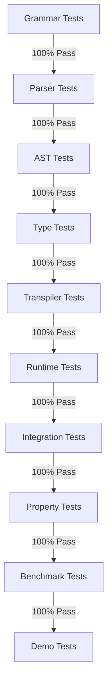

# EXTREME Test-Driven Development Specification
## Actor System Implementation for Ruchy

### Core Philosophy: No Code Without Tests

**The Iron Laws of EXTREME-TDD:**
1. **Write the test first** - Not a single line of implementation before test exists
2. **Red-Green-Refactor** - See it fail, make it pass, make it beautiful
3. **Test drives design** - If it's hard to test, the design is wrong
4. **100% coverage is minimum** - Not aspirational, mandatory
5. **Every bug becomes a test** - Bugs can only happen once

### Test Hierarchy and Execution Order

```mermaid
graph TD
    A[Grammar Tests] -->|100% Pass| B[Parser Tests]
    B -->|100% Pass| C[AST Tests]
    C -->|100% Pass| D[Type Tests]
    D -->|100% Pass| E[Transpiler Tests]
    E -->|100% Pass| F[Runtime Tests]
    F -->|100% Pass| G[Integration Tests]
    G -->|100% Pass| H[Property Tests]
    H -->|100% Pass| I[Benchmark Tests]
    I -->|100% Pass| J[Demo Tests]
```

---

## Sub-spec Index

| Sub-spec | Description | Link |
|----------|-------------|------|
| Phases 0-5: Infrastructure through Runtime | Test infrastructure & macros, grammar-first testing, parser test suite, type system tests, transpiler tests, runtime behavior tests | [extreme-tdd-actor-phases-0-5.md](sub/extreme-tdd-actor-phases-0-5.md) |
| Phases 6-8: Property, Mutation & Benchmarks | Property-based tests (proptest), mutation testing config & verification, benchmark tests (criterion), quality gates (coverage/complexity/performance), CI pipeline, EXTREME-TDD manifesto, implementation timeline | [extreme-tdd-actor-phases-6-8.md](sub/extreme-tdd-actor-phases-6-8.md) |

---

## The EXTREME-TDD Manifesto for Ruchy Actors

1. **Tests are the specification** - The test suite IS the documentation
2. **Coverage is not a metric, it's a requirement** - <95% = broken build
3. **Every bug is a missing test** - Bugs prove our tests were incomplete
4. **Mutation testing proves test quality** - If mutants survive, tests are weak
5. **Property tests prove correctness** - Examples test cases, properties prove laws
6. **Benchmarks prevent regression** - Performance is a feature
7. **TDD is not a practice, it's the only way** - Implementation without test is technical debt

## Timeline

- **Day 1**: Write ALL tests (no implementation)
- **Day 2-3**: Make parser tests pass
- **Day 4-5**: Make type tests pass  
- **Day 6-7**: Make transpiler tests pass
- **Day 8-9**: Make runtime tests pass
- **Day 10**: Make property tests pass
- **Day 11**: Make benchmarks pass
- **Day 12**: Demo ready

Total: 12 days from zero to demo with 100% test coverage.
