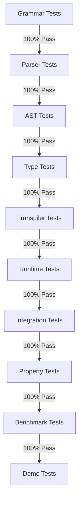

# Sub-spec: EXTREME TDD Actor — Phases 0-5: Infrastructure, Grammar, Parser, Types, Transpiler, Runtime

**Parent:** [EXTREME-TDD-ACTOR-SPEC.md](../EXTREME-TDD-ACTOR-SPEC.md) Phases 0-5

---

# EXTREME Test-Driven Development Specification
## Actor System Implementation for Ruchy

### Core Philosophy: No Code Without Tests

**The Iron Laws of EXTREME-TDD:**
1. **Write the test first** - Not a single line of implementation before test exists
2. **Red-Green-Refactor** - See it fail, make it pass, make it beautiful
3. **Test drives design** - If it's hard to test, the design is wrong
4. **100% coverage is minimum** - Not aspirational, mandatory
5. **Every bug becomes a test** - Bugs can only happen once

### Test Hierarchy and Execution Order



### Phase 0: Test Infrastructure (Before Any Implementation)

```rust
// tests/test_framework.rs
pub struct TestContext {
    parser: Parser,
    typechecker: TypeChecker,
    transpiler: Transpiler,
    runtime: ActorRuntime,
}

impl TestContext {
    pub fn assert_parse_error(&self, input: &str, expected: ParseError) {
        let result = self.parser.parse(input);
        assert_matches!(result, Err(e) if e == expected);
    }
    
    pub fn assert_type_error(&self, input: &str, expected: TypeError) {
        let ast = self.parser.parse(input).unwrap();
        let result = self.typechecker.check(ast);
        assert_matches!(result, Err(e) if e == expected);
    }
    
    pub fn assert_runtime_behavior<T>(&self, input: &str, assertion: impl Fn(T)) {
        let compiled = self.compile_and_run(input);
        assertion(compiled);
    }
}

// Macro for test generation
macro_rules! parser_test {
    ($name:ident, $input:expr, $expected:expr) => {
        #[test]
        fn $name() {
            let ctx = TestContext::new();
            let result = ctx.parse($input);
            assert_eq!(result.unwrap(), $expected);
        }
    };
}

// Property test macro
macro_rules! property_test {
    ($name:ident, $property:expr) => {
        #[test]
        fn $name() {
            proptest!(|input: TestInput| {
                $property(input);
            });
        }
    };
}
```

### Phase 1: Grammar-First Testing

```rust
// tests/grammar/actor_grammar_test.rs

#[test]
fn test_actor_grammar_bnf() {
    let grammar = r#"
        actor_def := 'actor' IDENT '{' actor_body '}'
        actor_body := (field | receive | hook)*
        field := IDENT ':' type
        receive := 'receive' IDENT '(' params ')' block
        hook := ('on_restart' | 'on_child_failure') '(' params ')' block
    "#;
    
    assert!(validate_bnf(grammar));
}

#[test]
fn test_message_operator_precedence() {
    // ! and ? should have specific precedence
    assert_precedence_order(&[
        (".", 100),   // Method call highest
        ("?", 90),    // Ask
        ("!", 80),    // Send  
        ("|>", 70),   // Pipeline
        ("+", 50),    // Addition lower
    ]);
}

#[test]
fn test_supervision_grammar() {
    let grammar = r#"
        supervision := 'supervise' strategy '{' children '}'
        strategy := 'OneForOne' | 'AllForOne' | 'RestForOne'
        children := (actor_spawn)*
        actor_spawn := 'spawn' actor_type init_args
    "#;
    
    assert!(validate_bnf(grammar));
}
```

### Phase 2: Parser Test Suite

```rust
// tests/parser/actor_parser_test.rs

const ACTOR_TEST_CASES: &[(&str, &str, AST)] = &[
    // Minimal actor
    (
        "minimal_actor",
        "actor Empty {}",
        AST::Actor(Actor { name: "Empty", fields: vec![], receives: vec![], hooks: vec![] })
    ),
    
    // Actor with state
    (
        "stateful_actor",
        "actor Counter { value: i32 }",
        AST::Actor(Actor {
            name: "Counter",
            fields: vec![Field { name: "value", ty: Type::I32 }],
            receives: vec![],
            hooks: vec![]
        })
    ),
    
    // Actor with receive
    (
        "receive_actor",
        r#"actor Handler {
            receive process(msg: String) {
                println(msg)
            }
        }"#,
        AST::Actor(Actor {
            name: "Handler",
            fields: vec![],
            receives: vec![Receive {
                name: "process",
                params: vec![Param { name: "msg", ty: Type::String }],
                body: Block(vec![Expr::Call("println", vec![Expr::Var("msg")])])
            }],
            hooks: vec![]
        })
    )
];

// Generate tests from cases
fn generate_parser_tests() {
    for (name, input, expected) in ACTOR_TEST_CASES {
        parser_test!(name, input, expected);
    }
}

// Edge cases and error conditions
#[test]
fn test_parse_nested_actors_forbidden() {
    let input = r#"
        actor Outer {
            actor Inner {}  // Should fail
        }
    "#;
    
    assert_parse_error(input, ParseError::NestedActorNotAllowed);
}

#[test]
fn test_parse_receive_outside_actor_forbidden() {
    let input = "receive orphan() {}";
    assert_parse_error(input, ParseError::ReceiveOutsideActor);
}
```

### Phase 3: Type System Tests

```rust
// tests/typechecker/actor_type_test.rs

#[test]
fn test_actor_ref_type_creation() {
    let actor = Actor { name: "Worker", ..default() };
    let actor_ref = Type::ActorRef(Box::new(Type::Actor("Worker")));
    
    assert!(actor_ref.is_sendable());
    assert!(actor_ref.is_sync());
    assert!(!actor_ref.is_copy());
}

#[test]
fn test_actor_intrinsic_properties() {
    // Every actor has these properties available
    let actor_type = parse_and_type_check(r#"
        actor MyActor {
            receive identify() -> String {
                self.id  // Intrinsic property
            }
            receive get_parent() -> Option<ActorRef> {
                parent  // Available if supervised
            }
        }
    "#);
    
    assert!(actor_type.has_intrinsic("id"));
    assert!(actor_type.has_intrinsic("parent"));
}

#[test]
fn test_message_type_compatibility() {
    let test_cases = vec![
        // (receiver_expects, sent_type, should_succeed)
        (Type::I32, Type::I32, true),
        (Type::I32, Type::String, false),
        (Type::Generic("T"), Type::I32, true),  // Generic accepts concrete
        (Type::Option(Box::new(Type::I32)), Type::I32, false),
    ];
    
    for (expected, sent, should_succeed) in test_cases {
        let result = check_message_type(expected, sent);
        assert_eq!(result.is_ok(), should_succeed);
    }
}

#[test]
fn test_supervision_type_constraints() {
    // Supervisable trait requirements
    let supervisable = Trait {
        name: "Supervisable",
        methods: vec![
            Method { name: "on_restart", returns: Type::Unit },
            Method { name: "get_state", returns: Type::Generic("State") },
            Method { name: "restore_state", params: vec![Type::Generic("State")] },
        ]
    };
    
    let actor_with_hooks = parse_and_type_check(r#"
        actor Supervised {
            state: String,
            on_restart() { self.state = "" }
            get_state() -> String { self.state }
            restore_state(s: String) { self.state = s }
        }
    "#);
    
    assert!(actor_with_hooks.implements(&supervisable));
}
```

### Phase 4: Transpiler Tests

```rust
// tests/transpiler/actor_transpiler_test.rs

#[test]
fn test_minimal_actor_transpilation() {
    let input = "actor Minimal {}";
    let output = transpile(input).unwrap();
    
    // Verify structure
    assert_contains!(output, "struct Minimal {");
    assert_contains!(output, "impl Minimal {");
    assert_contains!(output, "enum MinimalMessage {");
    
    // Verify it compiles
    assert!(rustc_check(&output).is_ok());
}

#[test]
fn test_message_handling_generation() {
    let input = r#"
        actor Echo {
            receive echo(msg: String) -> String {
                msg
            }
        }
    "#;
    
    let output = transpile(input).unwrap();
    
    // Check generated message enum
    assert_contains!(output, "enum EchoMessage {");
    assert_contains!(output, "    Echo { msg: String, reply: oneshot::Sender<String> },");
    
    // Check handler
    assert_contains!(output, "async fn handle_message(&mut self, msg: EchoMessage)");
    assert_contains!(output, "EchoMessage::Echo { msg, reply } => {");
    assert_contains!(output, "reply.send(msg)");
    
    // Verify it compiles and runs
    let test_harness = format!("{}\n{}", output, r#"
        #[tokio::test]
        async fn test_echo() {
            let (actor, handle) = Echo::spawn();
            let result = handle.echo("hello".to_string()).await;
            assert_eq!(result, "hello");
        }
    "#);
    
    assert!(compile_and_test(&test_harness).is_ok());
}

#[test]
fn test_supervision_code_generation() {
    let input = r#"
        actor Supervised {
            attempts: i32,
            
            on_restart() {
                self.attempts = 0
            }
            
            receive risky() -> Result<String, Error> {
                self.attempts += 1;
                if self.attempts < 3 {
                    Err(Error::new("not yet"))
                } else {
                    Ok("success")
                }
            }
        }
    "#;
    
    let output = transpile(input).unwrap();
    
    // Verify supervision traits
    assert_contains!(output, "impl Supervisable for Supervised");
    assert_contains!(output, "fn on_restart(&mut self)");
    
    // Verify restart logic
    assert_contains!(output, "self.attempts = 0");
}

#[test]
fn test_pipeline_operator_transpilation() {
    let input = r#"
        actor Pipeline {
            receive process() {
                // Pipeline operator routes async response to handler
                other_actor !> long_operation() |> handle_result
            }
            
            receive handle_result(result: String) {
                println(result)
            }
        }
    "#;
    
    let output = transpile(input).unwrap();
    
    // Verify pipeline transpiles to reply_to pattern
    assert_contains!(output, "other_actor.send_with_reply(");
    assert_contains!(output, "LongOperationMessage {");
    assert_contains!(output, "reply_to: self.handle_result_channel()");
    
    // Verify it compiles
    assert!(rustc_check(&output).is_ok());
}
```

### Phase 5: Runtime Behavior Tests

```rust
// tests/runtime/actor_runtime_test.rs

#[tokio::test]
async fn test_actor_actually_processes_messages() {
    let code = r#"
        actor Counter {
            value: i32,
            receive increment() { self.value += 1 }
            receive get() -> i32 { self.value }
        }
    "#;
    
    let runtime = compile_and_load(code).await;
    let counter = runtime.spawn_actor("Counter", json!({"value": 0})).await;
    
    counter.send("increment", json!({})).await;
    counter.send("increment", json!({})).await;
    let result = counter.ask("get", json!({})).await;
    
    assert_eq!(result, json!(2));
}

#[tokio::test(flavor = "multi_thread")]
async fn test_concurrent_actors_isolated() {
    let code = r#"
        actor Isolated {
            value: i32,
            receive set(v: i32) { self.value = v }
            receive get() -> i32 { self.value }
        }
    "#;
    
    let runtime = compile_and_load(code).await;
    let actors: Vec<_> = (0..100)
        .map(|i| runtime.spawn_actor("Isolated", json!({"value": i})))
        .collect();
    
    // Concurrent modifications
    let handles: Vec<_> = actors.iter().enumerate().map(|(i, actor)| {
        tokio::spawn(async move {
            actor.send("set", json!(i * 2)).await;
            actor.ask("get", json!({})).await
        })
    }).collect();
    
    let results: Vec<i32> = futures::future::join_all(handles).await
        .into_iter()
        .map(|r| r.unwrap())
        .collect();
    
    // Each actor should have its own value
    for (i, result) in results.iter().enumerate() {
        assert_eq!(*result, i * 2);
    }
}

#[tokio::test]
async fn test_supervision_restarts_failed_actor() {
    let code = r#"
        actor Failing {
            attempts: i32,
            
            receive fail_then_succeed() -> Result<String, Error> {
                self.attempts += 1;
                if self.attempts <= 2 {
                    panic!("Simulated failure");
                }
                Ok("Success")
            }
            
            on_restart() {
                // Keep attempts to eventually succeed
            }
        }
    "#;
    
    let runtime = compile_and_load(code).await;
    let supervisor = runtime.create_supervisor(
        SupervisorStrategy::OneForOne,
        3,  // max restarts
        Duration::from_secs(60)
    ).await;
    
    let actor = supervisor.spawn_child("Failing", json!({"attempts": 0})).await;
    
    // Should fail twice, restart each time, succeed on third
    let result = actor.ask_with_retry("fail_then_succeed", json!({}), 3).await;
    assert_eq!(result, Ok("Success"));
    
    // Verify it was restarted twice
    let stats = supervisor.get_stats().await;
    assert_eq!(stats.restarts_for(&actor), 2);
}
```
