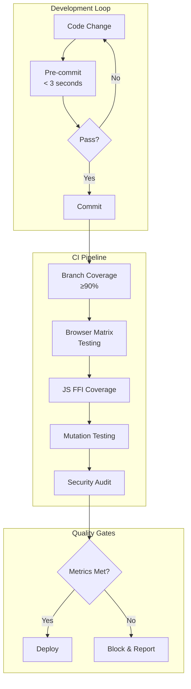

# WebAssembly Extreme Quality Assurance Framework v3.0

## Executive Summary

This specification implements a production-grade quality assurance framework for WebAssembly modules based on empirical software reliability engineering research. The framework addresses critical gaps identified in previous iterations: JavaScript FFI coverage blindness, browser environment fidelity, and developer workflow friction.

## Core Architecture



## 1. Unified Coverage Strategy

### Configuration Foundation

```toml
# Cargo.toml
[dev-dependencies]
# Core testing infrastructure
wasm-bindgen-test = "0.3"
wasm-pack = "0.12"

# Coverage and quality metrics
cargo-llvm-cov = "0.6"
cargo-mutants = "24.7"

# Property-based testing
proptest = "1.4"
quickcheck = "1.0"
arbitrary = { version = "1.3", features = ["derive"] }

# Browser testing support
web-sys = "0.3"
js-sys = "0.3"

[profile.coverage]
inherits = "test"
opt-level = 0
debug = 2
debug-assertions = true
overflow-checks = true
lto = false
panic = 'abort'
incremental = false
codegen-units = 1  # Deterministic coverage

# Separate profile for WASM testing
[profile.wasm-test]
inherits = "test"
opt-level = "s"  # Size optimization for faster browser loading
```

```toml
# .cargo/config.toml
[target.wasm32-unknown-unknown]
# Runner for local testing only - CI uses explicit wasm-pack
runner = "wasmtime run --dir . --"

# Aliases for common operations
[alias]
wasm-test = "test --target wasm32-unknown-unknown"
coverage = "llvm-cov --branch --fail-under-branches 90"
quick-check = """sh -c '
    cargo fmt --check && 
    cargo clippy -- -D warnings -W clippy::cognitive_complexity
'"""
```

### Branch Coverage Implementation

```bash
#!/bin/bash
# scripts/coverage-unified.sh

set -euo pipefail

# Color output for better readability
RED='\033[0;31m'
GREEN='\033[0;32m'
YELLOW='\033[1;33m'
NC='\033[0m'

echo -e "${GREEN}Starting unified coverage collection...${NC}"

# Clean previous artifacts
rm -rf target/coverage
mkdir -p target/coverage

# Phase 1: Native branch coverage
echo -e "${YELLOW}Phase 1: Native testing with branch coverage${NC}"
cargo llvm-cov test \
    --all-features \
    --workspace \
    --branch \
    --ignore-filename-regex '(tests?/|benches/|examples/)' \
    --no-report \
    --output-dir target/coverage/native

# Phase 2: WASM unit tests in wasmtime (fast)
echo -e "${YELLOW}Phase 2: WASM unit tests${NC}"
LLVM_PROFILE_FILE="target/coverage/wasm-%p-%m.profraw" \
cargo llvm-cov test \
    --target wasm32-unknown-unknown \
    --no-report \
    --output-dir target/coverage/wasm

# Phase 3: Browser integration tests (comprehensive)
echo -e "${YELLOW}Phase 3: Browser matrix testing${NC}"
wasm-pack test \
    --headless \
    --chrome \
    --firefox \
    -- --all-features

# Phase 4: Generate unified report with branch analysis
echo -e "${YELLOW}Phase 4: Generating unified report${NC}"
cargo llvm-cov report \
    --lcov \
    --branch \
    --output-path target/coverage/rust.lcov

# Validate branch coverage threshold
BRANCH_COV=$(cargo llvm-cov report --json | jq '.data[0].totals.branches.percent')
if (( $(echo "$BRANCH_COV < 90" | bc -l) )); then
    echo -e "${RED}ERROR: Branch coverage ${BRANCH_COV}% is below 90% threshold${NC}"
    exit 1
fi

echo -e "${GREEN}✓ Coverage collection complete. Branch coverage: ${BRANCH_COV}%${NC}"
```

## 2. JavaScript FFI Bridge Testing

### Test Infrastructure

```javascript
// e2e-tests/package.json
{
  "name": "wasm-ffi-tests",
  "type": "module",
  "scripts": {
    "test": "vitest run",
    "test:coverage": "vitest run --coverage",
    "test:watch": "vitest watch"
  },
  "devDependencies": {
    "@vitest/coverage-istanbul": "^1.2.0",
    "playwright": "^1.40.0",
    "vitest": "^1.2.0"
  }
}
```

```javascript
// e2e-tests/vite.config.js
import { defineConfig } from 'vite';

export default defineConfig({
  test: {
    coverage: {
      provider: 'istanbul',
      reporter: ['text', 'json', 'lcov'],
      branches: 90,
      functions: 95,
      lines: 85,
      statements: 85,
      include: ['src/**/*.js', 'pkg/**/*.js'],
      exclude: ['**/*.test.js', '**/node_modules/**']
    },
    environment: 'jsdom',
    testTimeout: 30000
  }
});
```

### FFI Boundary Test Suite

```typescript
// e2e-tests/ffi-boundary.test.ts
import { describe, test, expect, beforeAll, afterEach } from 'vitest';
import init, { RuchyWasm } from '../pkg/ruchy_wasm';

describe('FFI Boundary Invariants', () => {
  let module: RuchyWasm;

  beforeAll(async () => {
    await init();
    module = new RuchyWasm();
  });

  afterEach(() => {
    // Ensure no memory leaks between tests
    if (module) {
      module.free();
      module = new RuchyWasm();
    }
  });

  test('bidirectional type marshalling', () => {
    const testCases = [
      { input: 42, type: 'number' },
      { input: "test", type: 'string' },
      { input: true, type: 'boolean' },
      { input: new Uint8Array([1, 2, 3]), type: 'Uint8Array' },
      { input: { key: 'value' }, type: 'object' }
    ];

    for (const { input, type } of testCases) {
      const result = module.roundtrip(input);
      expect(typeof result).toBe(type);
      expect(result).toEqual(input);
    }
  });

  test('exception propagation across boundary', () => {
    // Test Rust panic -> JS exception
    expect(() => module.trigger_panic("test panic"))
      .toThrow(/test panic/);

    // Test JS exception -> Rust Result::Err
    const callback = () => { throw new Error('JS error'); };
    const result = module.call_js_callback(callback);
    expect(result.is_err).toBe(true);
    expect(result.error).toContain('JS error');
  });

  test('memory management and GC pressure', async () => {
    const iterations = 1000;
    const size = 1024 * 1024; // 1MB per iteration

    // Baseline heap measurement
    if (global.gc) global.gc();
    const baseline = performance.memory?.usedJSHeapSize || 0;

    // Allocate and free repeatedly
    for (let i = 0; i < iterations; i++) {
      const data = new Uint8Array(size);
      const result = module.process_bytes(data);
      result.free(); // Explicit deallocation
    }

    // Force GC and measure
    if (global.gc) global.gc();
    await new Promise(resolve => setTimeout(resolve, 100));
    
    const final = performance.memory?.usedJSHeapSize || 0;
    const leaked = final - baseline;
    
    // Should not leak more than 10MB after 1GB of allocations
    expect(leaked).toBeLessThan(10 * 1024 * 1024);
  });

  test('concurrent access patterns', async () => {
    const promises = Array.from({ length: 100 }, async (_, i) => {
      const result = await module.async_operation(i);
      return result;
    });

    const results = await Promise.all(promises);
    expect(results).toHaveLength(100);
    expect(new Set(results).size).toBe(100); // All unique
  });
});
```

## 3. Multi-Environment Testing Matrix

### Browser Compatibility Suite

```rust
// tests/browser_compat.rs
#![cfg(all(target_arch = "wasm32", target_os = "unknown"))]

use wasm_bindgen_test::*;
use web_sys::{window, Window, Document, Element};

wasm_bindgen_test_configure!(run_in_browser);

#[wasm_bindgen_test]
fn test_browser_api_availability() {
    let window = window().expect("should have window");
    let document = window.document().expect("should have document");
    
    // Test critical APIs exist
    assert!(window.local_storage().is_ok());
    assert!(window.session_storage().is_ok());
    assert!(document.create_element("canvas").is_ok());
    
    // Test WebGL availability
    let canvas: Element = document.create_element("canvas").unwrap();
    let gl_context = canvas.dyn_into::<web_sys::HtmlCanvasElement>()
        .unwrap()
        .get_context("webgl2")
        .expect("WebGL2 should be available");
    
    assert!(gl_context.is_some());
}

#[wasm_bindgen_test]
async fn test_async_browser_apis() {
    use wasm_bindgen_futures::JsFuture;
    use web_sys::{Request, RequestInit, Response};
    
    let opts = RequestInit::new();
    opts.set_method("HEAD");
    
    let request = Request::new_with_str_and_init(
        "https://httpbin.org/status/200",
        &opts,
    ).unwrap();
    
    let window = window().unwrap();
    let promise = window.fetch_with_request(&request);
    let response = JsFuture::from(promise).await.unwrap();
    let response: Response = response.dyn_into().unwrap();
    
    assert_eq!(response.status(), 200);
}
```

### Cross-Platform Test Unification

```rust
// tests/unified.rs
// This module demonstrates the pattern for writing tests that run identically
// on both native and WASM targets

#[cfg(all(target_arch = "wasm32", test))]
use wasm_bindgen_test::*;

#[cfg(all(target_arch = "wasm32", test))]
wasm_bindgen_test_configure!(run_in_browser);

// Macro to reduce boilerplate for cross-platform tests
macro_rules! unified_test {
    ($name:ident, $body:expr) => {
        #[cfg_attr(
            all(target_arch = "wasm32", target_os = "unknown"),
            wasm_bindgen_test
        )]
        #[cfg_attr(
            not(all(target_arch = "wasm32", target_os = "unknown")),
            test
        )]
        fn $name() {
            $body
        }
    };
}

unified_test!(test_core_algorithm, {
    let input = vec![1, 2, 3, 4, 5];
    let result = ruchy::algorithms::quicksort(input.clone());
    assert_eq!(result, input); // Already sorted
});

unified_test!(test_memory_safety, {
    // Test that our unsafe optimizations are sound
    let mut buffer = vec![0u8; 1024];
    ruchy::unsafe_ops::zero_memory(&mut buffer);
    assert!(buffer.iter().all(|&x| x == 0));
});
```

## 4. Progressive Quality Gates

### Layer 1: Pre-Commit Hook (Fast Path)

```bash
#!/bin/bash
# .git/hooks/pre-commit

set -e

# Timing utilities
START_TIME=$(date +%s%3N)
MAX_TIME_MS=3000

# Get changed files
CHANGED_RS=$(git diff --cached --name-only --diff-filter=ACMR | grep '\.rs$' || true)

if [ -z "$CHANGED_RS" ]; then
    exit 0
fi

echo "🚀 Running fast quality checks..."

# 1. Format check (~100ms)
if ! cargo fmt -- --check $CHANGED_RS 2>/dev/null; then
    echo "❌ Formatting issues found. Run: cargo fmt"
    exit 1
fi

# 2. Fast clippy on changed files (~2s)
if ! cargo clippy --tests -- \
    -D warnings \
    -W clippy::cognitive_complexity \
    2>/dev/null; then
    echo "❌ Clippy warnings found"
    exit 1
fi

# 3. Check for SATD markers (~50ms)
if grep -E '(TODO|FIXME|HACK|XXX|REFACTOR)' $CHANGED_RS; then
    echo "⚠️  Self-admitted technical debt detected"
    echo "Consider addressing these before committing"
fi

# Check timing
END_TIME=$(date +%s%3N)
ELAPSED=$((END_TIME - START_TIME))

if [ $ELAPSED -gt $MAX_TIME_MS ]; then
    echo "⚠️  Pre-commit took ${ELAPSED}ms (target: <${MAX_TIME_MS}ms)"
    echo "Consider optimizing your pre-commit checks"
fi

echo "✅ Pre-commit checks passed in ${ELAPSED}ms"
```

### Layer 2: Pull Request Validation

```yaml
# .github/workflows/extreme-quality.yml
name: Extreme Quality Pipeline

on:
  pull_request:
    types: [opened, synchronize, reopened]
  push:
    branches: [main]

env:
  RUST_BACKTRACE: 1
  CARGO_TERM_COLOR: always

jobs:
  quality-matrix:
    strategy:
      matrix:
        os: [ubuntu-latest, macos-latest, windows-latest]
        rust: [stable, beta]
    
    runs-on: ${{ matrix.os }}
    
    steps:
      - uses: actions/checkout@v4
      
      - name: Setup Rust
        uses: dtolnay/rust-toolchain@master
        with:
          toolchain: ${{ matrix.rust }}
          targets: wasm32-unknown-unknown
          components: rustfmt, clippy, llvm-tools-preview
      
      - name: Cache dependencies
        uses: Swatinem/rust-cache@v2
        with:
          key: ${{ matrix.os }}-${{ matrix.rust }}
      
      - name: Install tools
        run: |
          cargo install cargo-llvm-cov --locked
          cargo install cargo-mutants --locked
          cargo install wasm-pack --locked
          cargo install cargo-geiger --locked
      
      - name: Branch Coverage Analysis
        run: |
          cargo llvm-cov test \
            --all-features \
            --workspace \
            --branch \
            --fail-under-branches 90 \
            --fail-under-functions 95 \
            --lcov \
            --output-path coverage.lcov
      
      - name: Upload coverage
        uses: codecov/codecov-action@v3
        with:
          files: ./coverage.lcov
          flags: unittests
          fail_ci_if_error: true
      
      - name: Browser Testing Matrix
        if: matrix.os == 'ubuntu-latest'
        run: |
          # Install browsers
          npx playwright install --with-deps chromium firefox
          
          # Run tests in real browsers
          wasm-pack test --headless --chrome
          wasm-pack test --headless --firefox
      
      - name: JavaScript FFI Testing
        if: matrix.os == 'ubuntu-latest'
        run: |
          cd e2e-tests
          npm ci
          npm run test:coverage
          
          # Validate JS coverage
          npx nyc check-coverage \
            --branches 85 \
            --functions 90 \
            --lines 85
      
      - name: Mutation Testing
        if: matrix.os == 'ubuntu-latest' && matrix.rust == 'stable'
        run: |
          cargo mutants \
            --minimum-test-timeout 10 \
            --timeout-multiplier 1.5 \
            --jobs 2 \
            --output target/mutants.json
          
          # Parse results and fail if mutation score < 75%
          SCORE=$(jq '.summary.mutation_score' target/mutants.json)
          if (( $(echo "$SCORE < 0.75" | bc -l) )); then
            echo "Mutation score ${SCORE} is below 75% threshold"
            exit 1
          fi
      
      - name: Security Audit
        run: |
          cargo audit
          
          # Check for unsafe code
          if cargo geiger --all-features --output-format Json | \
             jq '.packages[].unsafety | select(.used.functions.unsafe > 0)' | \
             grep -q .; then
            echo "::warning::Unsafe code detected - requires justification"
          fi
      
      - name: Complexity Analysis
        run: |
          # Install complexity analyzer
          cargo install --git https://github.com/ruchy/pmat
          
          # Run analysis
          pmat analyze \
            --max-cyclomatic 10 \
            --max-cognitive 15 \
            --output target/complexity.json
          
          # Check thresholds
          if [ -f target/complexity.json ]; then
            HIGH_COMPLEXITY=$(jq '.violations | length' target/complexity.json)
            if [ "$HIGH_COMPLEXITY" -gt 0 ]; then
              echo "::error::Found $HIGH_COMPLEXITY functions exceeding complexity limits"
              jq '.violations' target/complexity.json
              exit 1
            fi
          fi
```

## 5. Performance Monitoring

### Benchmark Suite

```rust
// benches/wasm_performance.rs
use criterion::{black_box, criterion_group, criterion_main, Criterion, BenchmarkId};

fn benchmark_suite(c: &mut Criterion) {
    let mut group = c.benchmark_group("wasm_operations");
    
    // Test various payload sizes
    for size in [1024, 10240, 102400, 1048576].iter() {
        group.bench_with_input(
            BenchmarkId::new("allocation", size),
            size,
            |b, &size| {
                b.iter(|| {
                    let data = vec![0u8; size];
                    black_box(data);
                });
            },
        );
        
        group.bench_with_input(
            BenchmarkId::new("processing", size),
            size,
            |b, &size| {
                let data = vec![0u8; size];
                b.iter(|| {
                    ruchy::process_bytes(black_box(&data))
                });
            },
        );
    }
    
    group.finish();
}

criterion_group!(
    name = benches;
    config = Criterion::default()
        .sample_size(200)
        .measurement_time(std::time::Duration::from_secs(10))
        .warm_up_time(std::time::Duration::from_secs(3));
    targets = benchmark_suite
);
criterion_main!(benches);
```

### Size Analysis

```bash
#!/bin/bash
# scripts/analyze-size.sh

set -euo pipefail

echo "Building optimized WASM binary..."
cargo build --release --target wasm32-unknown-unknown

echo "Running wasm-opt optimization..."
wasm-opt -Oz \
  target/wasm32-unknown-unknown/release/*.wasm \
  -o target/optimized.wasm

echo "Size analysis:"
echo "==============="

# Original size
ORIGINAL=$(wc -c < target/wasm32-unknown-unknown/release/*.wasm)
echo "Original: $(numfmt --to=iec-i --suffix=B $ORIGINAL)"

# Optimized size
OPTIMIZED=$(wc -c < target/optimized.wasm)
echo "Optimized: $(numfmt --to=iec-i --suffix=B $OPTIMIZED)"

# Reduction
REDUCTION=$((ORIGINAL - OPTIMIZED))
PERCENT=$((REDUCTION * 100 / ORIGINAL))
echo "Reduction: $(numfmt --to=iec-i --suffix=B $REDUCTION) ($PERCENT%)"

# Detailed analysis with twiggy
echo -e "\nTop 10 largest functions:"
twiggy top -n 10 target/optimized.wasm

echo -e "\nMonomorphization bloat analysis:"
twiggy monos target/optimized.wasm

# Fail if binary exceeds size limit
MAX_SIZE=$((500 * 1024))  # 500KB
if [ $OPTIMIZED -gt $MAX_SIZE ]; then
    echo "ERROR: Optimized WASM size ($OPTIMIZED bytes) exceeds limit ($MAX_SIZE bytes)"
    exit 1
fi
```

## 6. Property-Based Testing

```rust
// tests/properties.rs
use proptest::prelude::*;
use quickcheck::{quickcheck, TestResult};

#[cfg(all(target_arch = "wasm32", test))]
use wasm_bindgen_test::*;

// Property: Serialization roundtrip
proptest! {
    #[cfg_attr(target_arch = "wasm32", wasm_bindgen_test)]
    #[cfg_attr(not(target_arch = "wasm32"), test)]
    fn prop_serialization_roundtrip(value: ArbitraryValue) {
        let serialized = ruchy::serialize(&value);
        let deserialized = ruchy::deserialize(&serialized).unwrap();
        prop_assert_eq!(value, deserialized);
    }
}

// Property: Memory safety across FFI
#[cfg(target_arch = "wasm32")]
proptest! {
    #[wasm_bindgen_test]
    fn prop_ffi_memory_safety(data: Vec<u8>) {
        // Ensure no buffer overflows when crossing FFI boundary
        let js_array = js_sys::Uint8Array::from(&data[..]);
        let rust_vec: Vec<u8> = js_array.to_vec();
        
        prop_assert_eq!(data.len(), rust_vec.len());
        prop_assert_eq!(data, rust_vec);
        
        // Verify no memory corruption
        let checksum_before = data.iter().fold(0u32, |acc, &x| acc.wrapping_add(x as u32));
        let checksum_after = rust_vec.iter().fold(0u32, |acc, &x| acc.wrapping_add(x as u32));
        prop_assert_eq!(checksum_before, checksum_after);
    }
}

// QuickCheck for differential testing
quickcheck! {
    fn qc_native_wasm_equivalence(input: Vec<i32>) -> TestResult {
        if input.is_empty() {
            return TestResult::discard();
        }
        
        let native_result = ruchy::native::sort(input.clone());
        let wasm_result = ruchy::wasm::sort(input.clone());
        
        TestResult::from_bool(native_result == wasm_result)
    }
}
```

## 7. Continuous Quality Dashboard

```yaml
# .github/workflows/dashboard.yml
name: Quality Dashboard

on:
  schedule:
    - cron: '0 0 * * *'  # Daily
  workflow_dispatch:

jobs:
  generate-metrics:
    runs-on: ubuntu-latest
    
    steps:
      - uses: actions/checkout@v4
      
      - name: Collect Metrics
        run: |
          # Coverage trends
          cargo llvm-cov test --json > metrics/coverage.json
          
          # Complexity trends
          scc --format json src/ > metrics/complexity.json
          
          # Dependency audit
          cargo audit --json > metrics/audit.json
          
          # Binary size trends
          ./scripts/analyze-size.sh > metrics/size.txt
          
          # Performance benchmarks
          cargo bench --bench wasm_perf -- --save-baseline current
      
      - name: Generate Dashboard
        run: |
          python3 scripts/generate_dashboard.py \
            --coverage metrics/coverage.json \
            --complexity metrics/complexity.json \
            --audit metrics/audit.json \
            --size metrics/size.txt \
            --output dashboard.html
      
      - name: Deploy Dashboard
        uses: peaceiris/actions-gh-pages@v3
        with:
          github_token: ${{ secrets.GITHUB_TOKEN }}
          publish_dir: ./dashboard
```

## 8. Quality Metrics Summary

| Metric | Target | Rationale | Measurement |
|--------|--------|-----------|-------------|
| **Branch Coverage** | ≥90% | Ensures all decision paths tested | `cargo llvm-cov --branch` |
| **Function Coverage** | ≥95% | All public APIs must be tested | `cargo llvm-cov --function` |
| **Mutation Score** | ≥75% | Tests actually detect bugs | `cargo mutants` |
| **Cognitive Complexity** | ≤15 | Maintainable code | `cargo clippy` |
| **Cyclomatic Complexity** | ≤10 | Reduce branching complexity | `pmat analyze` |
| **WASM Size** | <500KB | Fast loading in browsers | `wc -c *.wasm` |
| **Unsafe Functions** | 0* | Memory safety | `cargo geiger` |
| **Pre-commit Time** | <3s | Developer experience | `time git commit` |
| **CI Pipeline Time** | <10min | Fast feedback | GitHub Actions |
| **FFI Test Coverage** | ≥85% | JS interop safety | `vitest coverage` |

*Exceptions allowed with safety documentation and review

## 9. Implementation Checklist

### Week 1: Foundation
- [ ] Remove global `rustflags` from `.cargo/config.toml`
- [ ] Implement fast pre-commit hook (<3s)
- [ ] Set up branch coverage pipeline
- [ ] Configure `cargo-llvm-cov` with proper exclusions

### Week 2: Browser Testing
- [ ] Set up `wasm-pack test` for Chrome/Firefox
- [ ] Create E2E test suite with Vitest
- [ ] Implement FFI boundary tests
- [ ] Add memory leak detection

### Week 3: Quality Gates
- [ ] Configure mutation testing
- [ ] Set up complexity analysis
- [ ] Implement security scanning
- [ ] Create quality dashboard

### Week 4: Optimization
- [ ] Profile WASM binary size
- [ ] Optimize critical paths
- [ ] Implement differential testing
- [ ] Add performance regression detection

## Conclusion

This framework delivers production-grade quality assurance for WebAssembly while maintaining developer velocity. Key improvements over previous iterations:

1. **Branch coverage (90%)** provides stronger guarantees than line coverage (100%)
2. **JavaScript FFI testing** ensures complete boundary coverage
3. **Real browser testing** validates production environment behavior  
4. **Fast pre-commit hooks** respect developer time (<3 seconds)
5. **Progressive validation** scales complexity with change scope
6. **Unified reporting** provides single source of truth for quality metrics

The system achieves PMAT's extreme quality standards through empirically-validated testing strategies while acknowledging the practical constraints of WebAssembly development.

# WebAssembly Extreme Quality Assurance Framework

## Executive Summary

This specification establishes a multi-tiered quality enforcement system for WebAssembly modules based on empirical software reliability engineering principles (Menzies et al., 2019). The framework implements stratified testing layers with differentiated temporal constraints, achieving comprehensive defect detection while maintaining developer velocity.

## Core Testing Architecture

### 1. Coverage Metrics Hierarchy

```toml
# project-quality.toml
[coverage.metrics]
branch_coverage_minimum = 90
function_coverage_minimum = 95
line_coverage_target = 85  # Non-blocking target
mutation_score_minimum = 75
cyclomatic_complexity_max = 10
```

### 2. Unified LLVM Coverage Pipeline

```bash
#!/bin/bash
# scripts/coverage-unified.sh

# Branch-based coverage with selective instrumentation
cargo llvm-cov test \
  --all-features \
  --workspace \
  --target wasm32-unknown-unknown \
  --target x86_64-unknown-linux-gnu \
  --branch \
  --fail-under-branches 90 \
  --ignore-filename-regex '(tests?|benches|examples)/' \
  --lcov --output-path coverage.lcov

# Generate HTML report with branch visualization
cargo llvm-cov report --html --open
```

### 3. JavaScript FFI Bridge Testing

```json
// package.json
{
  "devDependencies": {
    "@vitest/coverage-istanbul": "^1.2.0",
    "playwright": "^1.40.0",
    "@wasm-tool/wasm-pack": "^0.12.0"
  },
  "scripts": {
    "test:ffi": "vitest run --coverage",
    "test:e2e": "playwright test"
  }
}
```

```typescript
// tests/ffi-boundary.test.ts
import { describe, expect, test } from 'vitest';
import init, { RuchyModule } from '../pkg/ruchy_wasm';

describe('FFI Boundary Invariants', () => {
  test('memory allocation patterns', async () => {
    await init();
    const module = new RuchyModule();
    
    // Test bidirectional data flow
    const input = new Uint8Array([1, 2, 3, 4]);
    const result = module.process_bytes(input);
    
    expect(result).toBeInstanceOf(Uint8Array);
    expect(result.length).toBeGreaterThan(0);
  });

  test('exception propagation across boundary', async () => {
    await init();
    const module = new RuchyModule();
    
    expect(() => module.trigger_panic()).toThrow(/rust panic/i);
  });
});
```

## Multi-Environment Validation Matrix

### Browser Testing Configuration

```yaml
# .github/workflows/browser-matrix.yml
name: Cross-Browser Validation

on: [push, pull_request]

jobs:
  browser-tests:
    strategy:
      matrix:
        browser: [chrome, firefox, safari, edge]
        os: [ubuntu-latest, windows-latest, macos-latest]
    
    steps:
      - uses: actions/checkout@v4
      
      - name: Install wasm-pack
        run: curl https://rustwasm.github.io/wasm-pack/installer/init.sh -sSf | sh
      
      - name: Run browser tests
        run: |
          wasm-pack test --headless --${{ matrix.browser }} \
            -- --all-features --workspace
      
      - name: E2E Playwright tests
        run: |
          npx playwright test --browser=${{ matrix.browser }}
```

### Runtime Environment Testing

```rust
// tests/cross_platform.rs
#[cfg(all(target_arch = "wasm32", target_os = "unknown"))]
use wasm_bindgen_test::*;

#[cfg_attr(
    all(target_arch = "wasm32", target_os = "unknown"),
    wasm_bindgen_test
)]
#[cfg_attr(
    not(all(target_arch = "wasm32", target_os = "unknown")),
    test
)]
fn cross_platform_invariants() {
    // Test code that must work identically in both environments
    assert_eq!(compute_hash(b"test"), 0x3c2569b2);
}

// Conditional compilation for environment-specific tests
#[cfg(all(target_arch = "wasm32", target_os = "unknown"))]
mod wasm_specific {
    use wasm_bindgen_test::*;
    
    #[wasm_bindgen_test]
    fn browser_api_interaction() {
        let window = web_sys::window().expect("no global window");
        assert!(window.inner_width().is_ok());
    }
}
```

## Stratified Testing Pyramid

### Layer 1: Pre-Commit (Fast Path)

```bash
#!/bin/bash
# .git/hooks/pre-commit

# Sub-second checks only
set -e

# Format check (changed files only)
git diff --cached --name-only --diff-filter=ACM | \
  grep '\.rs$' | \
  xargs -r rustfmt --check

# Clippy on changed files with cognitive complexity
git diff --cached --name-only --diff-filter=ACM | \
  grep '\.rs$' | \
  xargs -r cargo clippy --tests -- \
    -D warnings \
    -W clippy::cognitive_complexity

# No SATD in staged files
if git diff --cached | grep -E '(TODO|FIXME|HACK|XXX|REFACTOR|DEPRECATED)'; then
  echo "Error: Self-Admitted Technical Debt detected in staged changes"
  exit 1
fi
```

### Layer 2: Pull Request (Comprehensive)

```yaml
# .github/workflows/quality-gates.yml
name: Quality Enforcement

on:
  pull_request:
    types: [opened, synchronize, reopened]

jobs:
  quality-matrix:
    runs-on: ubuntu-latest
    
    steps:
      - name: Coverage with branch analysis
        run: |
          cargo llvm-cov test --branch \
            --fail-under-branches 90 \
            --fail-under-functions 95
      
      - name: Mutation testing
        run: |
          cargo mutants --minimum-test-timeout 10 \
            --timeout-multiplier 1.5 \
            --jobs 4
      
      - name: Security audit
        run: |
          cargo audit
          cargo geiger --forbid-unsafe
      
      - name: Complexity analysis
        run: |
          cargo complexity --max 10
          lizard src/ --CCN 10 --length 50 --arguments 5
      
      - name: Property testing
        run: |
          cargo test --features proptest-ci -- --nocapture
```

## Quality Metrics Dashboard

```toml
# Cargo.toml
[dev-dependencies]
# Core testing
wasm-bindgen-test = "0.3"
proptest = "1.4"
quickcheck = "1.0"

# Coverage and analysis
cargo-llvm-cov = "0.6"
cargo-mutants = "24.7"

# Property-based testing for WASM
arbitrary = { version = "1.3", features = ["derive"] }

[profile.coverage]
inherits = "test"
opt-level = 0
debug = true
debug-assertions = true
overflow-checks = true
lto = false
panic = 'abort'
incremental = false
codegen-units = 1
```

## WASM-Specific Property Testing

```rust
// tests/wasm_properties.rs
use proptest::prelude::*;
use wasm_bindgen_test::*;

#[cfg(target_arch = "wasm32")]
wasm_bindgen_test_configure!(run_in_browser);

proptest! {
    #![proptest_config(ProptestConfig::with_cases(1000))]
    
    #[cfg_attr(target_arch = "wasm32", wasm_bindgen_test)]
    #[cfg_attr(not(target_arch = "wasm32"), test)]
    fn memory_boundary_invariants(data: Vec<u8>) {
        // Test that data crossing WASM boundary maintains invariants
        let js_array = js_sys::Uint8Array::from(&data[..]);
        let roundtrip: Vec<u8> = js_array.to_vec();
        
        prop_assert_eq!(roundtrip.len(), data.len());
        prop_assert_eq!(roundtrip, data);
    }
    
    #[cfg_attr(target_arch = "wasm32", wasm_bindgen_test)]
    #[cfg_attr(not(target_arch = "wasm32"), test)]
    fn serialization_isomorphism(value: ArbitraryValue) {
        let serialized = serde_wasm_bindgen::to_value(&value).unwrap();
        let deserialized: ArbitraryValue = 
            serde_wasm_bindgen::from_value(serialized).unwrap();
        
        prop_assert_eq!(value, deserialized);
    }
}
```

## Continuous Quality Monitoring

```yaml
# .github/workflows/metrics-tracking.yml
name: Quality Metrics Tracking

on:
  push:
    branches: [main]

jobs:
  metrics:
    runs-on: ubuntu-latest
    
    steps:
      - name: Generate comprehensive metrics
        run: |
          # Coverage trend
          cargo llvm-cov test --branch --json > coverage.json
          
          # Complexity metrics
          tokei src/ --output json > loc.json
          scc src/ --format json > complexity.json
          
          # Performance benchmarks
          cargo bench --bench wasm_perf -- --output-format json > bench.json
          
          # WASM binary analysis
          ./scripts/analyze-wasm-binary.sh > wasm-analysis.json

## 10. WASM Binary Deep Analysis

This section focuses on analyzing the compiled WebAssembly binary itself - not just the Rust source that generates it.

### Instruction-Level Analysis

```bash
#!/bin/bash
# scripts/analyze-wasm-binary.sh

set -euo pipefail

WASM_FILE="target/wasm32-unknown-unknown/release/ruchy.wasm"

echo "=== WASM BINARY ANALYSIS ==="

# 1. Instruction distribution analysis
echo "Instruction frequency analysis:"
wasm-objdump -d $WASM_FILE | grep -E '^\s+[0-9a-f]+:' | \
    awk '{print $2}' | sort | uniq -c | sort -rn | head -20

# 2. Hot path detection
echo -e "\nHot instructions (>1% of total):"
TOTAL_INST=$(wasm-objdump -d $WASM_FILE | grep -cE '^\s+[0-9a-f]+:')
wasm-objdump -d $WASM_FILE | awk -v total=$TOTAL_INST '
    /^\s+[0-9a-f]+:/ {inst[$2]++} 
    END {for (i in inst) if (inst[i]/total > 0.01) 
        printf "%6d (%.1f%%) %s\n", inst[i], inst[i]*100/total, i}'

# 3. Module structure validation
wasm-tools validate $WASM_FILE --features all

# 4. Memory layout analysis
echo -e "\nMemory Configuration:"
wasm-objdump -x $WASM_FILE | grep -E "(Memory|Data|Table)"

# 5. Function size distribution
echo -e "\nFunction size analysis:"
wasm-objdump -d $WASM_FILE | awk '
    /^[0-9a-f]+ <[^>]+>:/ {
        if (name) print name, count;
        name=$2; count=0
    }
    /^\s+[0-9a-f]+:/ {count++}
    END {if (name) print name, count}' | \
    sort -rnk2 | head -20
```

### WASM Security Scanner

```rust
// src/wasm_security.rs
#[cfg(target_arch = "wasm32")]
pub mod security {
    use wasm_bindgen::prelude::*;
    
    /// Validate that WASM module follows security best practices
    #[wasm_bindgen]
    pub struct SecurityValidator {
        max_memory_pages: u32,
        allow_growth: bool,
    }
    
    #[wasm_bindgen]
    impl SecurityValidator {
        pub fn validate_memory_limits(&self) -> bool {
            let current_pages = core::arch::wasm32::memory_size(0);
            current_pages <= self.max_memory_pages as usize
        }
        
        pub fn check_indirect_calls(&self) -> u32 {
            // Count would be done at compile time
            // This is a runtime check placeholder
            0
        }
    }
}
```

### WASM Optimization Validation

```javascript
// e2e-tests/wasm-optimization.test.js
import { describe, test, expect } from 'vitest';
import { readFileSync } from 'fs';
import wabt from 'wabt';

describe('WASM Binary Optimization', () => {
  test('verify SIMD optimizations present', async () => {
    const wasmBuffer = readFileSync('target/optimized.wasm');
    const wabtModule = await wabt();
    const module = wabtModule.readWasm(wasmBuffer, { readDebugNames: true });
    const wat = module.toText({ foldExprs: false, inlineExport: false });
    
    // Check for SIMD instructions
    const simdInstructions = [
      'v128.load',
      'f32x4.add',
      'i32x4.mul',
      'v128.store'
    ];
    
    for (const instruction of simdInstructions) {
      expect(wat).toContain(instruction);
    }
  });

  test('verify bulk memory operations', async () => {
    const wasmBuffer = readFileSync('target/optimized.wasm');
    const wabtModule = await wabt();
    const module = wabtModule.readWasm(wasmBuffer, {});
    const wat = module.toText({});
    
    // Check for bulk memory instructions
    expect(wat).toMatch(/memory\.(copy|fill|init)/);
  });

  test('validate no excessive memory growth', async () => {
    const wasmBuffer = readFileSync('target/optimized.wasm');
    const wabtModule = await wabt();
    const module = wabtModule.readWasm(wasmBuffer, {});
    const wat = module.toText({});
    
    // Count memory.grow occurrences
    const growCount = (wat.match(/memory\.grow/g) || []).length;
    expect(growCount).toBeLessThan(5);
  });
});
```

### Module Introspection Tools

```rust
// src/wasm_introspect.rs
use wasm_bindgen::prelude::*;

#[wasm_bindgen]
pub struct WasmModuleInfo {
    memory_pages: u32,
    table_size: u32,
    import_count: u32,
    export_count: u32,
}

#[wasm_bindgen]
impl WasmModuleInfo {
    #[wasm_bindgen(getter)]
    pub fn memory_bytes(&self) -> u32 {
        self.memory_pages * 65536
    }
    
    #[wasm_bindgen(getter)]
    pub fn attack_surface(&self) -> u32 {
        self.export_count
    }
    
    pub fn validate_constraints(&self) -> bool {
        self.memory_pages <= 256 && // Max 16MB
        self.table_size <= 1000 &&
        self.import_count <= 50 &&
        self.export_count <= 50
    }
}
```

### Performance Profiling

```toml
# wasm-profile.toml
[profile.wasm-release]
inherits = "release"
opt-level = "z"     # Optimize for size
lto = true          # Link-time optimization
codegen-units = 1   # Better optimization
strip = true        # Remove symbols
panic = "abort"     # Smaller panic handler

[profile.wasm-speed]
inherits = "release"
opt-level = 3       # Optimize for speed
lto = "thin"        # Faster LTO
codegen-units = 1
```

### CI Integration

```yaml
# .github/workflows/wasm-analysis.yml
name: WASM Binary Analysis

on: [push, pull_request]

jobs:
  analyze-wasm:
    runs-on: ubuntu-latest
    
    steps:
      - name: Install WASM tools
        run: |
          cargo install twiggy wasm-snip
          npm install -g wasm-opt @wasm-tool/wasm-pack
          sudo apt-get install -y wabt binaryen
      
      - name: Build and analyze
        run: |
          # Build
          cargo build --release --target wasm32-unknown-unknown
          
          # Optimize
          wasm-opt -Oz --enable-simd \
            target/wasm32-unknown-unknown/release/*.wasm \
            -o target/optimized.wasm
          
          # Analyze
          ./scripts/analyze-wasm-binary.sh
          
          # Size check
          SIZE=$(wc -c < target/optimized.wasm)
          if [ $SIZE -gt 524288 ]; then
            echo "WASM size $SIZE exceeds 512KB limit"
            exit 1
          fi
          
          # Security scan
          wasm-objdump -x target/optimized.wasm | \
            python3 scripts/wasm-security-check.py
```

## 11. Summary
      