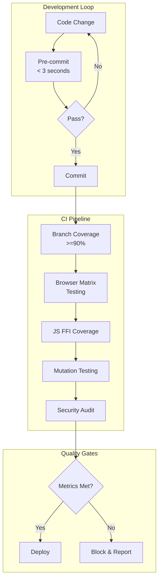

# WebAssembly Extreme Quality Assurance Framework v3.0

## Executive Summary

This specification implements a production-grade quality assurance framework for WebAssembly modules based on empirical software reliability engineering research. The framework addresses critical gaps identified in previous iterations: JavaScript FFI coverage blindness, browser environment fidelity, and developer workflow friction.

## Sub-spec Index

| Sub-spec | Sections | Description |
|----------|----------|-------------|
| [wasm-extreme-quality-coverage-ffi-env.md](sub/wasm-extreme-quality-coverage-ffi-env.md) | 1-3 | Unified Coverage Strategy, JavaScript FFI Bridge Testing, Multi-Environment Testing Matrix |
| [wasm-extreme-quality-gates-performance.md](sub/wasm-extreme-quality-gates-performance.md) | 4-9 | Progressive Quality Gates, Performance Monitoring, Property-Based Testing, Quality Dashboard |
| [wasm-extreme-quality-testing-arch-binary.md](sub/wasm-extreme-quality-testing-arch-binary.md) | 10-11 | Testing Architecture, Validation Matrix, Stratified Testing Pyramid, WASM Binary Deep Analysis |

---

## Core Architecture


```mermaid
graph TB
    subgraph "Development Loop"
        A[Code Change] --> B[Pre-commit<br/>< 3 seconds]
        B --> C{Pass?}
        C -->|Yes| D[Commit]
        C -->|No| A
    end
    
    subgraph "CI Pipeline"
        D --> E[Branch Coverage<br/>>=90%]
        E --> F[Browser Matrix<br/>Testing]
        F --> G[JS FFI Coverage]
        G --> H[Mutation Testing]
        H --> I[Security Audit]
    end
    
    subgraph "Quality Gates"
        I --> J{Metrics Met?}
        J -->|Yes| K[Deploy]
        J -->|No| L[Block & Report]
    end
```

## Conclusion

This framework delivers production-grade quality assurance for WebAssembly while maintaining developer velocity. Key improvements over previous iterations:

1. **Branch coverage (90%)** provides stronger guarantees than line coverage (100%)
2. **JavaScript FFI testing** ensures complete boundary coverage
3. **Real browser testing** validates production environment behavior  
4. **Fast pre-commit hooks** respect developer time (<3 seconds)
5. **Progressive validation** scales complexity with change scope
6. **Unified reporting** provides single source of truth for quality metrics

The system achieves PMAT's extreme quality standards through empirically-validated testing strategies while acknowledging the practical constraints of WebAssembly development.

---

# WebAssembly Extreme Quality Assurance Framework (Extended)

## Executive Summary

This specification establishes a multi-tiered quality enforcement system for WebAssembly modules based on empirical software reliability engineering principles (Menzies et al., 2019). The framework implements stratified testing layers with differentiated temporal constraints, achieving comprehensive defect detection while maintaining developer velocity.

## Core Testing Architecture

### 1. Coverage Metrics Hierarchy

```toml
# project-quality.toml
[coverage.metrics]
branch_coverage_minimum = 90
function_coverage_minimum = 95
line_coverage_target = 85  # Non-blocking target
mutation_score_minimum = 75
cyclomatic_complexity_max = 10
```

### 2. Unified LLVM Coverage Pipeline

```bash
#!/bin/bash
# scripts/coverage-unified.sh

# Branch-based coverage with selective instrumentation
cargo llvm-cov test \
  --all-features \
  --workspace \
  --target wasm32-unknown-unknown \
  --target x86_64-unknown-linux-gnu \
  --branch \
  --fail-under-branches 90 \
  --ignore-filename-regex '(tests?|benches|examples)/' \
  --lcov --output-path coverage.lcov

# Generate HTML report with branch visualization
cargo llvm-cov report --html --open
```

### 3. JavaScript FFI Bridge Testing

```json
// package.json
{
  "devDependencies": {
    "@vitest/coverage-istanbul": "^1.2.0",
    "playwright": "^1.40.0",
    "@wasm-tool/wasm-pack": "^0.12.0"
  },
  "scripts": {
    "test:ffi": "vitest run --coverage",
    "test:e2e": "playwright test"
  }
}
```

```typescript
// tests/ffi-boundary.test.ts
import { describe, expect, test } from 'vitest';
import init, { RuchyModule } from '../pkg/ruchy_wasm';

describe('FFI Boundary Invariants', () => {
  test('memory allocation patterns', async () => {
    await init();
    const module = new RuchyModule();
    
    // Test bidirectional data flow
    const input = new Uint8Array([1, 2, 3, 4]);
    const result = module.process_bytes(input);
    
    expect(result).toBeInstanceOf(Uint8Array);
    expect(result.length).toBeGreaterThan(0);
  });

  test('exception propagation across boundary', async () => {
    await init();
    const module = new RuchyModule();
    
    expect(() => module.trigger_panic()).toThrow(/rust panic/i);
  });
});
```

## 11. Summary
