# Ruchy Testing Infrastructure Documentation

## Overview

This document describes the testing infrastructure for Ruchy, including both the current implementation for validating book examples and the future roadmap for native Ruchy testing commands.

## Current Testing Architecture (v0.4.x)

### Binary Compilation Pipeline

```
.ruchy file → Parser → AST → Transpiler → Rust code → LLVM → Native Binary → Execution
```

Every Ruchy script goes through this pipeline to produce an optimized native binary via LLVM.

### Testing Harness API

The `ruchy::testing` module provides a public API for external projects (particularly `ruchy-book`) to validate code examples:

```rust
use ruchy::testing::{RuchyTestHarness, OptLevel};

// Create a test harness
let harness = RuchyTestHarness::new();

// Validate a single file
let result = harness.validate_file(Path::new("example.ruchy"))?;
assert!(result.compile_success);

// Assert specific output
harness.assert_output(
    r#"println("Hello")"#,
    "Hello",
    "hello_test"
)?;

// Validate all files in a directory
let results = harness.validate_directory(Path::new("examples/"))?;
```

### Configuration Options

```rust
let harness = RuchyTestHarness {
    keep_intermediates: false,      // Don't keep temp files
    optimization_level: OptLevel::Basic,  // -O2 LLVM optimization
    timeout_secs: 30,               // 30 second timeout
};
```

### For Book Repository Usage

The `ruchy-book` repository will use this infrastructure in its CI/CD:

```toml
# ruchy-book/Cargo.toml
[dev-dependencies]
ruchy = "0.4.13"

[[test]]
name = "validate_examples"
```

```rust
// ruchy-book/tests/validate_examples.rs
use ruchy::testing::RuchyTestHarness;

#[test]
fn test_all_book_examples() {
    let harness = RuchyTestHarness::new();
    
    // Validate all chapter examples
    for chapter in 1..=20 {
        let dir = format!("listings/ch{:02}/", chapter);
        let results = harness.validate_directory(Path::new(&dir))
            .expect("Failed to validate chapter examples");
        
        for result in results {
            assert!(result.compile_success, 
                    "Example {} failed to compile", result.name);
            
            // Check against expected output if it exists
            let output_file = Path::new(&result.name)
                .with_extension("output");
            if output_file.exists() {
                let expected = fs::read_to_string(output_file)?;
                assert_eq!(result.execution_output.unwrap().trim(), 
                          expected.trim());
            }
        }
    }
}
```

## Future CLI Commands (v0.5.x and beyond)

### Native Ruchy Testing Commands

Once Ruchy reaches self-hosting capability, users will have native commands:

#### `ruchy test` - Run tests
```bash
# Run all tests in current project
ruchy test

# Run specific test file
ruchy test tests/math_test.ruchy

# Run with coverage
ruchy test --coverage

# Watch mode
ruchy test --watch

# Run only tests matching pattern
ruchy test --filter "math_*"
```

Example test file:
```ruchy
// tests/math_test.ruchy
#[test]
fn test_addition() {
    assert_eq(2 + 2, 4)
}

#[test]
fn test_multiplication() {
    assert_eq(3 * 3, 9)
}

#[test]
#[should_panic(expected = "division by zero")]
fn test_division_by_zero() {
    let x = 10 / 0
}
```

#### `ruchy check` - Type checking
```bash
# Type check all files
ruchy check

# Check specific file
ruchy check src/main.ruchy

# Check with verbose output
ruchy check --verbose

# Strict mode (all warnings are errors)
ruchy check --strict
```

#### `ruchy lint` - Code quality
```bash
# Run default lints
ruchy lint

# Auto-fix issues
ruchy lint --fix

# Use specific lint profile
ruchy lint --profile strict

# Custom lint configuration
ruchy lint --config .ruchy-lint.toml
```

Lint configuration:
```toml
# .ruchy-lint.toml
[lints]
complexity = "warn"
unused_variables = "error"
naming_conventions = "warn"
documentation = "allow"

[rules.complexity]
max_cyclomatic = 10
max_cognitive = 15
```

#### `ruchy fmt` - Code formatting
```bash
# Format all files
ruchy fmt

# Format specific directory
ruchy fmt src/

# Check formatting without changing
ruchy fmt --check

# Use custom style
ruchy fmt --style compact
```

Format configuration:
```toml
# .ruchy-fmt.toml
indent_style = "space"
indent_size = 4
max_line_length = 100
trailing_comma = "always"
```

#### `ruchy build` - Compilation
```bash
# Build current project
ruchy build

# Release build with full LLVM optimizations
ruchy build --release

# Target specific architecture
ruchy build --target x86_64-unknown-linux-gnu

# Output binary name
ruchy build -o myapp

# Show LLVM IR
ruchy build --emit llvm-ir
```

#### `ruchy run` - Execution
```bash
# Run a script
ruchy run script.ruchy

# Run with arguments
ruchy run main.ruchy -- arg1 arg2

# Run in debug mode
ruchy run --debug script.ruchy

# Profile execution
ruchy run --profile script.ruchy
```

#### `ruchy doc` - Documentation
```bash
# Generate documentation
ruchy doc

# Open in browser
ruchy doc --open

# Include private items
ruchy doc --private

# Generate markdown
ruchy doc --format markdown
```

#### `ruchy bench` - Benchmarking
```bash
# Run all benchmarks
ruchy bench

# Run specific benchmark
ruchy bench bench_sorting

# Compare with baseline
ruchy bench --baseline main

# Save results
ruchy bench --save results.json
```

Example benchmark:
```ruchy
#[bench]
fn bench_quicksort(b: &mut Bencher) {
    let data = random_array(1000)
    b.iter(|| {
        quicksort(data.clone())
    })
}
```

### Command Integration with Book Examples

The book will teach these commands progressively:

1. **Chapter 1**: `ruchy run` - Running your first program
2. **Chapter 3**: `ruchy fmt` - Keeping code clean
3. **Chapter 5**: `ruchy check` - Understanding types
4. **Chapter 7**: `ruchy test` - Writing tests
5. **Chapter 9**: `ruchy lint` - Code quality
6. **Chapter 12**: `ruchy bench` - Performance
7. **Chapter 15**: `ruchy build --release` - Production builds

## Testing Philosophy

### Principles

1. **Fast Feedback**: Tests should run in <5 seconds for typical projects
2. **Clear Errors**: Test failures should pinpoint the exact issue
3. **Progressive Disclosure**: Simple cases simple, complex cases possible
4. **Book Integration**: Every book example is a test case

### Test Categories

1. **Unit Tests**: Test individual functions
2. **Integration Tests**: Test module interactions
3. **Property Tests**: Generative testing with random inputs
4. **Snapshot Tests**: Compare output against saved snapshots
5. **Benchmark Tests**: Performance regression prevention
6. **Doc Tests**: Examples in documentation are tested

## Implementation Timeline

### Phase 1 (Current - v0.4.x)
- ✅ Basic test harness for book validation
- ✅ LLVM compilation pipeline
- ✅ Integration with cargo test
- 🚧 Property-based testing
- 🚧 Benchmark suite

### Phase 2 (v0.5.x)
- [ ] Native `ruchy test` command
- [ ] Native `ruchy check` command
- [ ] Native `ruchy fmt` command
- [ ] Basic `ruchy lint` rules

### Phase 3 (v0.6.x)
- [ ] Full `ruchy lint` with custom rules
- [ ] `ruchy bench` with statistical analysis
- [ ] `ruchy doc` generation
- [ ] IDE integration APIs

### Phase 4 (v1.0)
- [ ] Self-hosting: Ruchy compiler written in Ruchy
- [ ] Full test coverage tools
- [ ] Mutation testing support
- [ ] Fuzzing integration

## Usage Examples

### Current: Testing Book Examples (Rust/Cargo)

```bash
# In ruchy-book repository
cargo test --test validate_examples
```

### Future: Native Ruchy Testing

```bash
# In any Ruchy project
ruchy test                 # Run all tests
ruchy fmt --check && ruchy lint && ruchy test  # Full CI pipeline
ruchy build --release      # Production build
```

### Book Example Validation Flow

```mermaid
graph LR
    A[.ruchy file] --> B[Parse AST]
    B --> C[Type Check]
    C --> D[Transpile to Rust]
    D --> E[Compile via LLVM]
    E --> F[Execute Binary]
    F --> G[Compare Output]
    G --> H{Match?}
    H -->|Yes| I[✅ Pass]
    H -->|No| J[❌ Fail with Diff]
```



## Error Reporting

Test failures provide clear, actionable feedback:

```
❌ Test failed: examples/fibonacci.ruchy

Expected output:
  55

Actual output:
  89

Compilation details:
  Parse: ✅ Success (12ms)
  Transpile: ✅ Success (8ms)
  LLVM Compile: ✅ Success (243ms)
  Execution: ✅ Success (3ms)
  Output: ❌ Mismatch

Hint: Check the fibonacci logic in lines 3-5
```

## Performance Targets

- **Parse**: >50MB/s throughput
- **Transpile**: <15ms for typical program
- **LLVM Compile**: <5s for book examples
- **Test Execution**: <100ms per test
- **Full Test Suite**: <60s for entire book

## Conclusion

This testing infrastructure ensures:
1. Every book example compiles and runs correctly
2. Users have a smooth learning experience
3. The language evolves toward self-hosting
4. Quality is maintained through automated testing

The progression from cargo-based testing to native Ruchy commands mirrors the language's evolution from transpiler to self-hosted compiler.